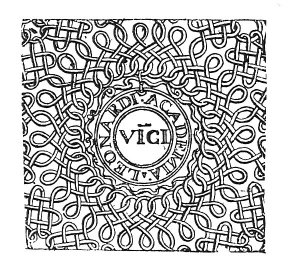

  
[Intangible Textual Heritage](../../index)  [Age of Reason](../index) 
[Index](index)   
[X. Studies and Sketches for Pictures and Decorations Index](dvs011)  
  [Previous](0704)  [Next](dv10782) 

------------------------------------------------------------------------

[Buy this Book at
Amazon.com](https://www.amazon.com/exec/obidos/ASIN/0486225720/internetsacredte)

------------------------------------------------------------------------

*The Da Vinci Notebooks at Intangible Textual Heritage*

### 705.

Snow taken from the high peaks of mountains might be carried to hot
places and let to fall at festivals in open places at summer time.

 

------------------------------------------------------------------------

[Next: Note](dv10782)
