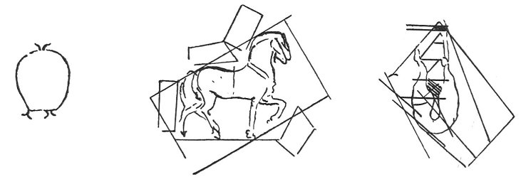

  
[Intangible Textual Heritage](../../index)  [Age of Reason](../index) 
[Index](index)   
[XI. The Notes on Sculpture Index](dvs013)  
  [Previous](0709)  [Next](0711) 

------------------------------------------------------------------------

[Buy this Book at
Amazon.com](https://www.amazon.com/exec/obidos/ASIN/0486225739/internetsacredte)

------------------------------------------------------------------------

*The Da Vinci Notebooks at Intangible Textual Heritage*

### 710.

 Notes on the casting of the Sforza monument
(710-715).Three braces which bind the mould.

\[If you want to make simple casts quickly, make them in a box of river
sand wetted with vinegar.\]

 

p. 11

\[When you shall have made the mould upon the horse you must make the
thickness of the metal in clay.\]

Observe in alloying how many hours are wanted for each hundredweight.
\[In casting each one keep the furnace and its fire well stopped up.\]
\[Let the inside of all the moulds be wetted with linseed oil or oil of
turpentine, and then take a handful of powdered borax and Greek pitch
with aqua vitae, and pitch the mould over outside so that being under
ground the damp may not \[damage it?\]

\[To manage the large mould make a model of the small mould, make a
small room in proportion.\]

\[Make the vents in the mould while it is on the horse.\]

Hold the hoofs in the tongs, and cast them with fish glue. Weigh the
parts of the mould and the quantity of metal it will take to fill them,
and give so much to the furnace that it may afford to each part its
amount of metal; and this you may know by weighing the clay of each part
of the mould to which the quantity in the furnace must correspond. And
this is done in order that the furnace for the legs when filled may not
have to furnish metal from the legs to help out the head, which would be
impossible. \[Cast at the same casting as the horse the little door\]

 [335](#fn_1)

------------------------------------------------------------------------

### Footnotes

[11:335](0710.htm#fr_1) : The importance of the
notes included under this number is not diminished by the fact that they
have been lightly crossed out with red chalk. Possibly they were the
first scheme for some fuller observations which no longer exist; or
perhaps they were crossed out when Leonardo found himself obliged to
give up the idea of casting the equestrian statue. In the original the
first two sketches are above l. 1, and the third below l. 9.

------------------------------------------------------------------------

[Next: 711.](0711)
