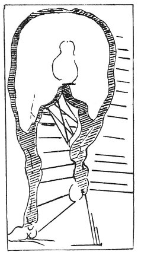

  
[Intangible Textual Heritage](../../index)  [Age of Reason](../index) 
[Index](index)   
[XI. The Notes on Sculpture Index](dvs013)  
  [Previous](0713)  [Next](0715) 

------------------------------------------------------------------------

[Buy this Book at
Amazon.com](https://www.amazon.com/exec/obidos/ASIN/0486225739/internetsacredte)

------------------------------------------------------------------------

*The Da Vinci Notebooks at Intangible Textual Heritage*

### 714.

 

Salt may be made from human excrements, burnt and calcined, made into
lees and dried slowly at a fire, and all the excrements produce salt in
a similar way and these salts when distilled, are very strong.

 [338](#fn_4)

------------------------------------------------------------------------

### Footnotes

[13:338](0714.htm#fr_4) : VASARI repeatedly
states, in the fourth chapter of his *Introduzione della Scultura*, that
in preparing to cast bronze statues horse-dung was frequently used by
sculptors. If, notwithstanding this, it remains doubtful whether I am
justified in having introduced here this text of but little interest, no
such doubt can be attached to the sketch which accompanies it.

------------------------------------------------------------------------

[Next: 715.](0715)
