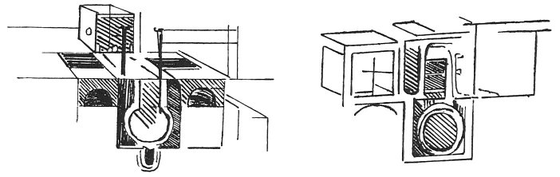

  
[Intangible Textual Heritage](../../index)  [Age of Reason](../index) 
[Index](index)   
[XI. The Notes on Sculpture Index](dvs013)  
  [Previous](0714)  [Next](0717) 

------------------------------------------------------------------------

[Buy this Book at
Amazon.com](https://www.amazon.com/exec/obidos/ASIN/0486225739/internetsacredte)

------------------------------------------------------------------------

*The Da Vinci Notebooks at Intangible Textual Heritage*

### 715.

p. 14

 

### METHOD OF FOUNDING AGAIN.

This may be done when the furnace is made  [339](#fn_5) strong and bruised.

7l6.

 Models for the horse of the Sforza monument
(716-718).Messer Galeazzo's big genet

------------------------------------------------------------------------

### Footnotes

[14:339](0715.htm#fr_5) : this note is written
below the sketches.

------------------------------------------------------------------------

[Next: 717.](0717)
