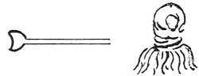

  
[Intangible Textual Heritage](../../index)  [Age of Reason](../index) 
[Index](index)   
[XI. The Notes on Sculpture Index](dvs013)  
  [Previous](0736)  [Next](0738) 

------------------------------------------------------------------------

[Buy this Book at
Amazon.com](https://www.amazon.com/exec/obidos/ASIN/0486225739/internetsacredte)

------------------------------------------------------------------------

*The Da Vinci Notebooks at Intangible Textual Heritage*

### 737.

 

### HOW CASTS OUGHT TO BE POLISHED.

Make a bunch of iron wire as thick as thread, and scrub them with \[this
and\] water; hold a bowl underneath that it may not make a mud below.

### HOW TO REMOVE THE ROUGH EDGES FROM BRONZE.

Make an iron rod, after the manner of a large chisel, and with this rub
over those seams on the bronze which remain on the casts of the guns,
and which are caused by the joins in the mould; but make the tool heavy
enough, and let the strokes be long and broad.

### TO FACILITATE MELTING.

First alloy part of the metal in the crucible, then put it in the
furnace, and this being in a molten state will assist in beginning to
melt the copper.

### TO PREVENT THE COPPER COOLING IN THE FURNACE.

When the copper cools in the furnace, be ready, as soon as you perceive
it, to cut it with a long stick while it is still in a paste; or if it
is quite cold cut it as lead is cut with broad and large chisels.

p. 22

### IF YOU HAVE TO MAKE A LARGE CAST.

If you have to make a cast of a hundred thousand pounds do it with two
furnaces and with 2000 pounds in each, or as much as 3000 pounds at
most.

------------------------------------------------------------------------

[Next: 738.](0738)
