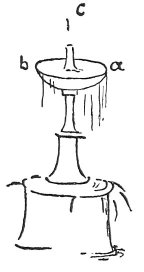

  
[Intangible Textual Heritage](../../index)  [Age of Reason](../index) 
[Index](index)   
[XII. Architectural Designs Index](dvs014)  
  [Previous](0762)  [Next](dv20072) 

------------------------------------------------------------------------

[Buy this Book at
Amazon.com](https://www.amazon.com/exec/obidos/ASIN/0486225739/internetsacredte)

------------------------------------------------------------------------

*The Da Vinci Notebooks at Intangible Textual Heritage*

### 763.

 

The water should be allowed to fall from the whole circle *a b*.  [392](#fn_58)

------------------------------------------------------------------------

### Footnotes

[70:392](0763.htm#fr_58) : Other drawings of
fountains are given on [Pl. CI](pl101.htm#img_pl101) (W. XX); the
original is a pen and ink drawing on blue paper; on [Pl.
CIII](pl103.htm#img_pl103) (MS. B.) and [Pl.
LXXXII](pl082.htm#img_pl082).

------------------------------------------------------------------------

[Next: VI. Studies of architectural details.](dv20072)
