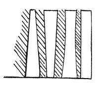

  
[Intangible Textual Heritage](../../index)  [Age of Reason](../index) 
[Index](index)   
[XII. Architectural Designs Index](dvs014)  
  [Previous](0765)  [Next](0767) 

------------------------------------------------------------------------

[Buy this Book at
Amazon.com](https://www.amazon.com/exec/obidos/ASIN/0486225739/internetsacredte)

------------------------------------------------------------------------

*The Da Vinci Notebooks at Intangible Textual Heritage*

### 766.

 

The ancient architects ...... beginning with the Egyptians (?) who, as
Diodorus Siculus writes, were the first to build and construct large
cities and castles, public and private buildings of fine form, large and
well proportioned .....

The column, which has its thickness at the third part .... The one which
would be thinnest in the middle, would break ...; the one which is of
equal thickness and of equal strength, is better for the edifice. The
second best as to the usefulness will be the one whose greatest
thickness is where it joins with the base.

 [395](#fn_61)

p. 73

The capital must be formed in this way. Divide its thickness at the top
into 8; at the foot make it 5/7, and let it be 5/7 high and you will
have a square; afterwards divide the height into 8 parts as you did for
the column, and then take 1/8 for the echinus and another eighth for the
thickness of the abacus on the top of the capital. The horns of the
abacus of the capital have to project beyond the greatest width of the
bell 2/7, i. e. sevenths of the top of the bell, so 1/7 falls to the
projection of each horn. The truncated part of the horns must be as
broad as it is high. I leave the rest, that is the ornaments, to the
taste of the sculptors. But to return to the columns and in order to
prove the reason of their strength or weakness according to their shape,
I say that when the lines starting from the summit of the column and
ending at its base and their direction and length ..., their distance
apart or width may be equal; I say that this column ...

------------------------------------------------------------------------

### Footnotes

[72:395](0766.htm#fr_61) : See [Pl.
CIII](pl103.htm#img_pl103), No. 3, where the sketches belonging to lines
10--16 are reproduced, but reversed. The sketch of columns, here
reproduced by a wood cut, stands in the original close to lines 5--8.

------------------------------------------------------------------------

[Next: 767.](0767)
