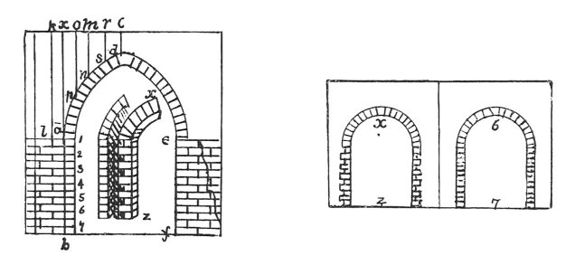

  
[Intangible Textual Heritage](../../index)  [Age of Reason](../index) 
[Index](index)   
[XIII. Theoretical Writings on Architecture Index](dvs015)  
  [Previous](0775)  [Next](0777) 

------------------------------------------------------------------------

[Buy this Book at
Amazon.com](https://www.amazon.com/exec/obidos/ASIN/0486225739/internetsacredte)

------------------------------------------------------------------------

*The Da Vinci Notebooks at Intangible Textual Heritage*

### 776.

This wall will break under the arch *e f*, because the seven whole
square bricks are not sufficient to sustain the spring of the arch
placed on them. And these seven bricks will give way in their middle
exactly as appears in *a b*. The reason is, that the brick *a* has above
it only the weight *a k*, whilst the last brick under the arch has above
it the weight *c d x a*.

p. 82

*c d* seems to press on the arch towards the abutment at the point *p*
but the weight *p o* opposes resistence to it, whence the whole

 

pressure is transmitted to the root of the arch. Therefore the foot of
the arch acts like 7 6, which is more than double of *x z*.

------------------------------------------------------------------------

[Next: 777.](0777)
