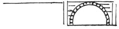
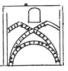
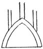
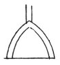
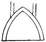
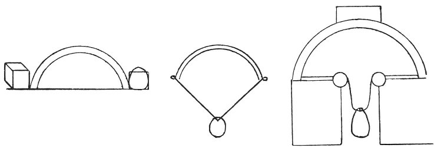
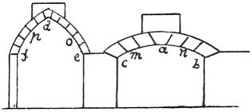

  
[Intangible Textual Heritage](../../index)  [Age of Reason](../index) 
[Index](index)   
[XIII. Theoretical Writings on Architecture Index](dvs015)  
  [Previous](0779)  [Next](0781) 

------------------------------------------------------------------------

[Buy this Book at
Amazon.com](https://www.amazon.com/exec/obidos/ASIN/0486225739/internetsacredte)

------------------------------------------------------------------------

*The Da Vinci Notebooks at Intangible Textual Heritage*

### 780.

### ON THE STRENGTH OF THE ARCH.

 

The way to give stability to the arch is to fill the spandrils with good
masonry up to the level of its summit.

### ON THE LOADING OF ROUND ARCHES.

 

### ON THE PROPER MANNER OF LOADING THE POINTED ARCH.

 

### ON THE EVIL EFFECTS OF LOADING THE POINTED ARCH DIRECTLY ABOVE ITS CROWN.

 

p. 88

### ON THE DAMAGE DONE TO THE POINTED ARCH BY THROWING THE PRESSURE ON THE FLANKS.

 

 

 

An arch of small curve is safe in itself, but if it be heavily charged,
it is necessary to strengthen the flanks well. An arch of a very large
curve is weak in itself, and stronger if it be charged, and will do
little harm to its abutments, and its places of giving way are *o p*.

 [404](#fn_70)

------------------------------------------------------------------------

### Footnotes

[88:404](0780.htm#fr_70) : Inside the large
figure on the righi is the note: *Da pesare la forza dell' archo*.

------------------------------------------------------------------------

[Next: 781.](0781)
