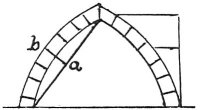

  
[Intangible Textual Heritage](../../index)  [Age of Reason](../index) 
[Index](index)   
[XIII. Theoretical Writings on Architecture Index](dvs015)  
  [Previous](0781)  [Next](0783) 

------------------------------------------------------------------------

[Buy this Book at
Amazon.com](https://www.amazon.com/exec/obidos/ASIN/0486225739/internetsacredte)

------------------------------------------------------------------------

*The Da Vinci Notebooks at Intangible Textual Heritage*

### 782.

 

A continuous body which has been forcibly bent into an arch, thrusts in
the direction of the straight line, which it tends to recover.

------------------------------------------------------------------------

[Next: 783.](0783)
