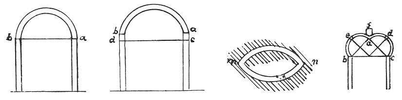

  
[Intangible Textual Heritage](../../index)  [Age of Reason](../index) 
[Index](index)   
[XIII. Theoretical Writings on Architecture Index](dvs015)  
  [Previous](0784)  [Next](0786) 

------------------------------------------------------------------------

[Buy this Book at
Amazon.com](https://www.amazon.com/exec/obidos/ASIN/0486225739/internetsacredte)

------------------------------------------------------------------------

*The Da Vinci Notebooks at Intangible Textual Heritage*

### 785.

p. 90

### ON THE STRENGTH OF THE ARCH IN ARCHITECTURE.

The stability of the arch built by an architect resides in the tie and
in the flanks.

### ON THE POSITION OF THE TIE IN THE ABOVE NAMED ARCH.

The position of the tie is of the same importance at the beginning of
the arch and at the top of the perpendicular pier on which it rests.
This is proved by the 2nd "of supports" which says: that part of a
support has least resistance which is farthest from its solid
attachment; hence, as the top of the pier is farthest from the middle of
its true foundation and the same being the case at the opposite
extremities of the arch which are the points farthest from the middle,
which is really its \[upper\] attachment, we have concluded that the tie
*a b* requires to be in such a position as that its opposite ends are
between the four above-mentioned extremes.

The adversary says that this arch must be more than half a circle, and
that then it will not need a tie, because then the ends will not thrust
outwards but inwards, as is seen in the excess at *a c*, *b d*. To this
it must be answered that this would be a very poor device, for three
reasons. The first refers to the strength of the arch, since it is
proved that the circular parallel being composed of two semicircles will
only break where these semicircles cross each other, as is seen in the
figure *n m;* besides this it follows that there is a wider space
between the extremes of the semicircle than between the plane of the
walls; the third reason is that the weight placed to counterbalance the
strength of the arch diminishes in proportion as the piers of the arch
are wider than the space between the piers. Fourthly in proportion as
the parts at *c a b d* turn outwards, the piers are weaker to support
the arch above them. The 5th is that all the material and weight of the

p. 91

arch which are in excess of the semicircle are useless and indeed
mischievous; and here it is to be noted that the weight placed above the
arch will be more likely to break the arch at *a b*, where the curve of
the excess begins that is added to the semicircle, than if the pier were
straight up to its junction with the semicircle \[spring of the arch\].

### AN ARCH LOADED OVER THE CROWN WILL GIVE WAY AT THE LEFT HAND AND RIGHT HAND QUARTERS.

This is proved by the 7th of this which says: The opposite ends of the
support are equally pressed upon by the weight suspended to them; hence
the weight shown at *f* is felt at *b c*, that is half at each
extremity; and by the third which says: in a support of equal strength
\[throughout\] that portion will give way soonest which is farthest from
its attachment; whence it follows that *d* being equally distant from
*f, e* .....

 

If the centering of the arch does not settle as the arch settles, the
mortar, as it dries, will shrink and detach itself from the bricks
between which it was laid to keep them together; and as it thus leaves
them disjoined the vault will remain loosely built, and the rains will
soon destroy it.

------------------------------------------------------------------------

[Next: 786.](0786)
