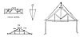

  
[Intangible Textual Heritage](../../index)  [Age of Reason](../index) 
[Index](index)   
[XIII. Theoretical Writings on Architecture Index](dvs015)  
  [Previous](0792)  [Next](0794) 

------------------------------------------------------------------------

[Buy this Book at
Amazon.com](https://www.amazon.com/exec/obidos/ASIN/0486225739/internetsacredte)

------------------------------------------------------------------------

*The Da Vinci Notebooks at Intangible Textual Heritage*

### 793.

p. 98

### V.

### ON THE RESISTANCE OF BEAMS.

[  
Click to enlarge](img/v209800.jpg)

That angle will offer the greatest resistance which is most acute, and
the most obtuse will be the weakest.

 [406](#fn_72)

------------------------------------------------------------------------

### Footnotes

[98:406](0793.htm#fr_72) : The three smaller
sketches accompany the text in the original, but the larger one is not
directly connected with it. It is to be found on fol. 89a of the same
Manuscript and there we read in a note, written underneath, *coverchio
della perdicha del castello* (roof of the flagstaff of the
castle),--Compare also [Pl. XCIII](pl093.htm#img_pl093), No. 1.

------------------------------------------------------------------------

[Next: 794.](0794)
