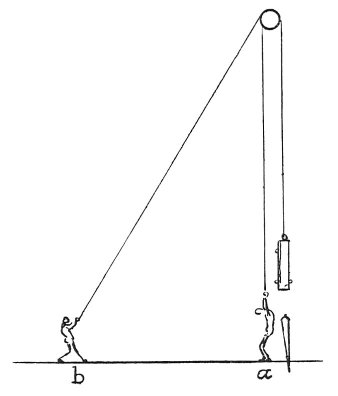

  
[Intangible Textual Heritage](../../index)  [Age of Reason](../index) 
[Index](index)   
[XIII. Theoretical Writings on Architecture Index](dvs015)  
  [Previous](0794)  [Next](dv20106) 

------------------------------------------------------------------------

[Buy this Book at
Amazon.com](https://www.amazon.com/exec/obidos/ASIN/0486225739/internetsacredte)

------------------------------------------------------------------------

*The Da Vinci Notebooks at Intangible Textual Heritage*

### 795.

### ON THE LENGTH OF BEAMS.

That beam which is more than 20 times as long as its greatest thickness
will be of brief duration and will break in half; and

p. 99

 

remember, that the part built into the wall should be steeped in hot
pitch and filleted with oak boards likewise so steeped. Each beam must
pass through its walls and be secured beyond the walls with sufficient
chaining, because in consequence of earthquakes the beams are often seen
to come out of the walls and bring down the walls and floors; whilst if
they are chained they will hold the walls strongly together and the
walls will hold the floors. Again I remind you never to put plaster over
timber. Since by expansion and shrinking of the timber produced by damp
and dryness such floors often crack, and once cracked their divisions
gradually produce dust and an ugly effect. Again remember not to lay a
floor on beams supported on arches; for, in time the floor which is made
on beams settles somewhat in the middle while that part of the floor
which rests on the arches remains in its place; hence, floors laid over
two kinds of supports look, in time, as if they were made in hills
 [407](#fn_73)

 

------------------------------------------------------------------------

### Footnotes

[99:407](0795.htm#fr_73) : 19 M. RAVAISSON, in
his edition of MS. A gives a very different rendering of this passage
translating it thus: *Les planchers qui sont soutenus par deux
differentes natures de supports paraissent avec le temps faits en voute
a cholli*.

------------------------------------------------------------------------

[Next: Remarks on the style of Leonardo's architecture](dv20106)
