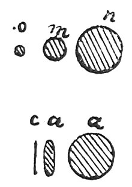

  
[Intangible Textual Heritage](../../index)  [Age of Reason](../index) 
[Index](index)   
[XIV. Anatomy, Zoology and Physiology Index](dvs016)  
  [Previous](0828)  [Next](0830) 

------------------------------------------------------------------------

[Buy this Book at
Amazon.com](https://www.amazon.com/exec/obidos/ASIN/0486225739/internetsacredte)

------------------------------------------------------------------------

*The Da Vinci Notebooks at Intangible Textual Heritage*

### 829.

### OF THE EYES IN ANIMALS.

 

The eyes of all animals have their pupils adapted to dilate and diminish
of their own accord in proportion to the greater or less light of the
sun or other luminary. But in birds the variation is much greater; and
particularly in nocturnal birds, such as horned owls, and in the eyes of
one species of owl; in these the pupil dilates in such away as to occupy
nearly the whole eye, or diminishes to the size of a grain of millet,
and always preserves the circular form. But in the Lion tribe, as
panthers, pards, ounces, tigers, lynxes, Spanish cats and other similar
animals the pupil diminishes from the perfect circle to the figure of a
pointed oval such as is shown in the margin. But man having a weaker
sight than any other animal is less hurt by a very strong light and his
pupil increases but little in dark places; but in the eyes of these
nocturnal animals, the horned owl--a bird which is the largest of all
nocturnal birds--the power of vision increases so much that in the
faintest nocturnal light (which we call darkness) it sees

p. 123

with much more distinctness than we do in the splendour of noon day, at
which time these birds remain hidden in dark holes; or if indeed they
are compelled to come out into the open air lighted up by the sun, they
contract their pupils so much that their power of sight diminishes
together with the quantity of light admitted.

Study the anatomy of various eyes and see which are the muscles which
open and close the said pupils of the eyes of animals.

 [429](#fn_95)

------------------------------------------------------------------------

### Footnotes

[123:429](0829.htm#fr_95) : Compare No. 24,
lines 8 and fol.

------------------------------------------------------------------------

[Next: 830.](0830)
