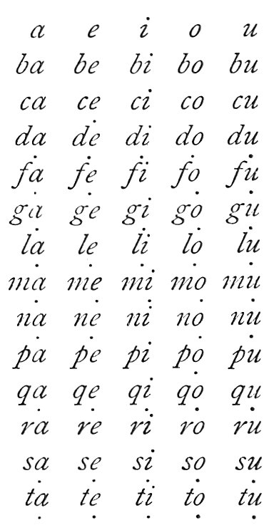

  
[Intangible Textual Heritage](../../index)  [Age of Reason](../index) 
[Index](index)   
[XIV. Anatomy, Zoology and Physiology Index](dvs016)  
  [Previous](0831)  [Next](0833) 

------------------------------------------------------------------------

[Buy this Book at
Amazon.com](https://www.amazon.com/exec/obidos/ASIN/0486225739/internetsacredte)

------------------------------------------------------------------------

*The Da Vinci Notebooks at Intangible Textual Heritage*

### 832.

p. 124

 

 Remarks on the organs of speech (832.
833).The tongue is found to have 24 muscles which correspond to
the six muscles which compose the portion of the tongue which moves in
the mouth.

And when *a o u* are spoken with a clear and rapid pronunciation, it is
necessary, in order to pronounce continuously, without any pause
between, that the opening of the lips should close by degrees; that is,
they are wide apart in saying *a*, closer in saying *o*, and much closer
still to pronounce *u*.

It may be shown how all the vowels are pronounced with the farthest
portion of the false palate which is above the epiglottis.

------------------------------------------------------------------------

[Next: 833.](0833)
