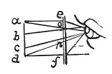

  
[Intangible Textual Heritage](../../index)  [Age of Reason](../index) 
[Index](index)   
[XV. Astronomy Index](dvs018)  
  [Previous](0868)  [Next](0870) 

------------------------------------------------------------------------

[Buy this Book at
Amazon.com](https://www.amazon.com/exec/obidos/ASIN/0486225739/internetsacredte)

------------------------------------------------------------------------

*The Da Vinci Notebooks at Intangible Textual Heritage*

### 869.

### PERSPECTIVE.

It is possible to find means by which the eye shall not see remote
objects as much

p. 141

 

diminished as in natural perspective, which diminishes them by reason of
the convexity of the eye which necessarily intersects, at its surface,
the pyramid of every image conveyed to the eye at a right angle on its
spherical surface. But by the method I here teach in the margin \[9\]
these pyramids are intersected at right angles close to the surface of
the pupil. The convex pupil of the eye can take in the whole of our
hemisphere, while this will show only a single star; but where many
small stars transmit their images to the surface of the pupil those
stars are extremely small; here only one star is seen but it will be
large. And so the moon will be seen larger and its spots of a more
defined form  [446](#fn_112) . You must place
close to the eye a glass filled with the water of which mention is made
in number 4 of Book 113 "On natural substances"  [447](#fn_113) ; for this water makes objects which
are enclosed in balls of crystalline glass appear free from the glass.

### OF THE EYE.

Among the smaller objects presented to the pupil of the eye, that which
is closest to it, will be least appreciable to the eye. And at the same
time, the experiments here made with the power of sight, show that it is
not reduced to speck if the &c \[32\] [448](#fn_114) .

Read in the margin.

\[34\]Those objects are seen largest which come to the eye at the
largest angles.

But the images of the objects conveyed to the pupil of the eye are
distributed to the pupil exactly as they are distributed in the air: and
the proof of this is in what follows; that when we look at the starry
sky, without gazing more fixedly at one star than another, the sky
appears all strewn with stars; and their proportions to the eye are the
same as in the sky and likewise the spaces between them \[61\].

 [449](#fn_115)

------------------------------------------------------------------------

### Footnotes

[141:446](0869.htm#fr_112) 20 and fol.:
Telescopes were not in use till a century later. Compare No. 910 and
page 136.

[141:447](0869.htm#fr_113) 23: *libro* 113.
This is perhaps the number of a book in some library catalogue. But it
may refer, on the other hand, to one of the 120 Books mentioned in No.
796. l. 84.

[141:448](0869.htm#fr_114) 32: Compare with
this the passage in Vol. I, No. 52, written about twenty years earlier.

[141:449](0869.htm#fr_115) : 9. 32. *in
margine:* lines 34-61 are, in the original, written on the margin and
above them is the diagram to which Leonardo seems to refer here.

------------------------------------------------------------------------

[Next: 870.](0870)
