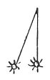

  
[Intangible Textual Heritage](../../index)  [Age of Reason](../index) 
[Index](index)   
[XV. Astronomy Index](dvs018)  
  [Previous](0873)  [Next](0875) 

------------------------------------------------------------------------

[Buy this Book at
Amazon.com](https://www.amazon.com/exec/obidos/ASIN/0486225739/internetsacredte)

------------------------------------------------------------------------

*The Da Vinci Notebooks at Intangible Textual Heritage*

### 874.

 On the luminosity of the Earth in the universal
space (874-878).In my book I propose to show, how the ocean and
the other seas must, by means of the sun, make our world shine with the
appearance of a moon, and to the remoter worlds it looks like a star;
and this I shall prove.

 

Show, first that every light at a distance from the eye throws out rays
which appear to increase the size of the luminous body; and from this it
follows that 2 ... [452](#fn_118) .

\[11\]The moon is cold and moist. Water is cold and moist. Thus our seas
must appear to the moon as the moon does to us.

------------------------------------------------------------------------

### Footnotes

[144:452](0874.htm#fr_118) 10: Here the text
breaks off; lines 11 and fol. are written in the margin.

------------------------------------------------------------------------

[Next: 875.](0875)
