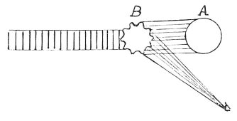

  
[Intangible Textual Heritage](../../index)  [Age of Reason](../index) 
[Index](index)   
[XV. Astronomy Index](dvs018)  
  [Previous](0876)  [Next](0878) 

------------------------------------------------------------------------

[Buy this Book at
Amazon.com](https://www.amazon.com/exec/obidos/ASIN/0486225739/internetsacredte)

------------------------------------------------------------------------

*The Da Vinci Notebooks at Intangible Textual Heritage*

### 877.

 

This will have before it the treatise on light and shade.

The edges in the moon will be most strongly lighted and reflect most
light, because, there, nothing will be visible but the tops of the waves
of the water  [456](#fn_122) .

------------------------------------------------------------------------

### Footnotes

[147:456](0877.htm#fr_122) 5: I have thought it
unnecessary to reproduce the detailed explanation of the theory of
reflection on waves contained in the passage which follows this.

------------------------------------------------------------------------

[Next: 878.](0878)
