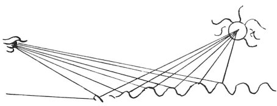

  
[Intangible Textual Heritage](../../index)  [Age of Reason](../index) 
[Index](index)   
[XV. Astronomy Index](dvs018)  
  [Previous](0877)  [Next](0879) 

------------------------------------------------------------------------

[Buy this Book at
Amazon.com](https://www.amazon.com/exec/obidos/ASIN/0486225739/internetsacredte)

------------------------------------------------------------------------

*The Da Vinci Notebooks at Intangible Textual Heritage*

### 878.

 

The sun will appear larger in moving water or on waves than in still
water; an example is the light reflected on the strings of a monochord.

------------------------------------------------------------------------

[Next: 879.](0879)
