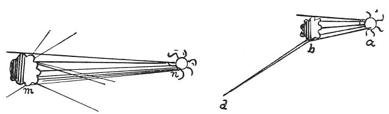
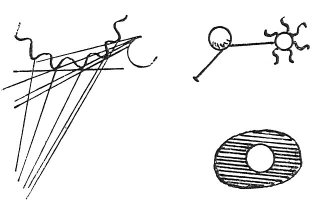

  
[Intangible Textual Heritage](../../index)  [Age of Reason](../index) 
[Index](index)   
[XV. Astronomy Index](dvs018)  
  [Previous](0895)  [Next](0897) 

------------------------------------------------------------------------

[Buy this Book at
Amazon.com](https://www.amazon.com/exec/obidos/ASIN/0486225739/internetsacredte)

------------------------------------------------------------------------

*The Da Vinci Notebooks at Intangible Textual Heritage*

### 896.

p. 157

### OF THE MOON.

The moon has no light in itself; but so much of it as faces the sun is
illuminated, and of that illumined portion we see so much as faces the
earth. And the moon's night receives just as much light as is lent it by
our waters as they reflect the image of the sun, which is mirrored in
all those waters which are on the side towards the sun. The outside or
surface of the waters forming the seas of the moon and of the seas of
our globe is always ruffled little or much, or more or less--and this
roughness causes an extension of the numberless images of the sun which
are repeated in the ridges and hollows, the sides and fronts of the
innumerable waves; that is to say in as many different spots on each
wave as our eyes find different positions to view them from. This could
not happen, if the aqueous sphere which covers a great part of the moon
were uniformly spherical, for then the images of the sun would be one to
each spectator, and its reflections would be separate and independent
and its radiance would always appear circular; as is plainly to be seen
in the gilt balls placed on the tops of high buildings. But if those
gilt balls were rugged or composed of several little balls, like
mulberries, which are a black fruit composed of minute round globules,
then each portion of these little balls, when seen in the sun, would
display to the eye the lustre resulting from the reflection of the sun,
and thus, in one and the same body many tiny suns would be seen; and
these often combine at a long distance and appear as one. The lustre of
the new moon is brighter and stronger, than when the moon is full; and
the reason of this is that the angle of incidence is more obtuse in the
new than in the full moon, in which the angles \[of incidence and
reflection\] are highly acute. The waves of the moon therefore mirror
the sun in the hollows of the waves as well as on the ridges, and the
sides remain in shadow. But at the sides

p. 158

of the moon the hollows of the waves do not catch the sunlight, but only
their crests; and thus the images are fewer and more mixed up with the
shadows in the hollows; and this intermingling of the shaded and
illuminated spots comes to the eye with a mitigated splendour, so that
the edges will be darker, because the curves of the sides of the waves
are insufficient to reflect to the eye the rays that fall upon them. Now
the new moon naturally reflects the solar rays more directly towards the
eye from the

 

crests of the waves than from any other part, as is shown by the form of
the moon, whose rays a strike the waves *b* and are reflected in the
line *b d*, the eye being situated at *d*. This cannot happen at the
full moon, when the solar rays, being in the west, fall on the extreme
waters of the moon to the East from *n* to *m*, and are not reflected to
the eye in the West, but are thrown back eastwards, with but slight
deflection from the straight course of the solar ray; and thus the angle
of incidence is very wide indeed.

 

The moon is an opaque and solid body and if, on the contrary, it were
transparent, it would not receive the light of the sun.

The yellow or yolk of an egg remains in the middle of the albumen,
without moving on either side; now it is either lighter or heavier than
this albumen, or equal to it; if it is lighter, it ought to rise above
all the albumen and stop in contact with the shell

p. 159

of the egg; and if it is heavier, it ought to sink, and if it is equal,
it might just as well be at one of the ends, as in the middle or below
\[54\].

 [469](#fn_135)

The innumerable images of the solar rays reflected from the innumerable
waves of the sea, as they fall upon those waves, are what cause us to
see the very broad and continuous radiance on the surface of the sea.

------------------------------------------------------------------------

### Footnotes

[159:469](0896.htm#fr_135) 48-64: Compare No.
861.

------------------------------------------------------------------------

[Next: 897.](0897)
