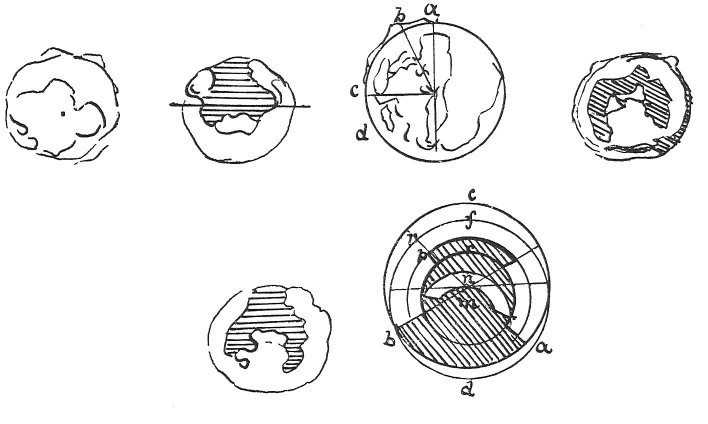

  
[Intangible Textual Heritage](../../index)  [Age of Reason](../index) 
[Index](index)   
[XVI. Physical Geography Index](dvs019)  
  [Previous](0937)  [Next](0939) 

------------------------------------------------------------------------

[Buy this Book at
Amazon.com](https://www.amazon.com/exec/obidos/ASIN/0486225739/internetsacredte)

------------------------------------------------------------------------

*The Da Vinci Notebooks at Intangible Textual Heritage*

### 938.

### OF THE EARTH.

 

The great elevations of the peaks of the mountains above the sphere of
the water may have resulted from this that: a very large portion of the
earth which was filled with water that is to say the vast cavern inside
the earth may have fallen in a vast part of its vault towards the centre
of the earth, being pierced by means of the course of the springs which
continually wear away the place where they pass.

Sinking in of countries like the Dead Sea in Syria, that is Sodom and
Gomorrah.

It is of necessity that there should be more water than land, and the
visible portion of

p. 184

the sea does not show this; so that there must be a great deal of water
inside the earth, besides that which rises into the lower air and which
flows through rivers and springs.

 [497](#fn_163)

------------------------------------------------------------------------

### Footnotes

[184:497](0938.htm#fr_163) : The small sketch
below on the left, is placed in the original close to the text referring
to the Dead Sea.

------------------------------------------------------------------------

[Next: 939.](0939)
