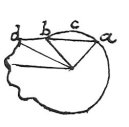

  
[Intangible Textual Heritage](../../index)  [Age of Reason](../index) 
[Index](index)   
[XVI. Physical Geography Index](dvs019)  
  [Previous](0941)  [Next](0943) 

------------------------------------------------------------------------

[Buy this Book at
Amazon.com](https://www.amazon.com/exec/obidos/ASIN/0486225739/internetsacredte)

------------------------------------------------------------------------

*The Da Vinci Notebooks at Intangible Textual Heritage*

### 942.

p. 186

### OF THE SEA, WHICH TO MANY FOOLS APPEARS TO BE HIGHER THAN THE EARTH WHICH FORMS ITS SHORE.

 

 The relative height of the surface of the sea to
that of the land (942-945).*b d* is a plain through which a river
flows to the sea; this plain ends at the sea, and since in fact the dry
land that is uncovered is not perfectly level--for, if it were, the
river would have no motion--as the river does move, this place is a
slope rather than a plain; hence this plain *d b* so ends where the
sphere of water begins that if it were extended in a continuous line to
*b a* it would go down beneath the sea, whence it follows that the sea
*a c b* looks higher than the dry land.

Obviously no portions of dry land left uncovered by water can ever be
lower than the surface of the watery sphere.

------------------------------------------------------------------------

[Next: 943.](0943)
