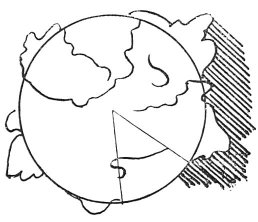

  
[Intangible Textual Heritage](../../index)  [Age of Reason](../index) 
[Index](index)   
[XVI. Physical Geography Index](dvs019)  
  [Previous](0943)  [Next](0945) 

------------------------------------------------------------------------

[Buy this Book at
Amazon.com](https://www.amazon.com/exec/obidos/ASIN/0486225739/internetsacredte)

------------------------------------------------------------------------

*The Da Vinci Notebooks at Intangible Textual Heritage*

### 944.

p. 187

### THE OPINION OF SOME PERSONS WHO SAY THAT THE WATER OF SOME SEAS IS HIGHER THAN THE HIGHEST SUMMITS OF MOUNTAINS; AND NEVERTHELESS THE WATER WAS FORCED UP TO THESE SUMMITS.

 

Water would not move from place to place if it were not that it seeks
the lowest level and by a natural consequence it never can return to a
height like that of the place where it first on issuing from the
mountain came to light. And that portion of the sea which, in your vain
imagining, you say was so high that it flowed over the summits of the
high mountains, for so many centuries would be swallowed up and poured
out again through the issue from these mountains. You can well imagine
that all the time that Tigris and Euphrates

------------------------------------------------------------------------

[Next: 945.](0945)
