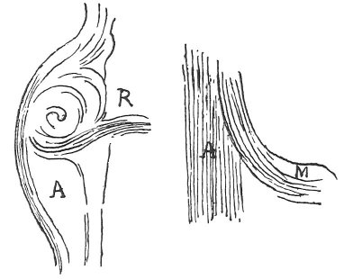

  
[Intangible Textual Heritage](../../index)  [Age of Reason](../index) 
[Index](index)   
[XVI. Physical Geography Index](dvs019)  
  [Previous](0971)  [Next](0973) 

------------------------------------------------------------------------

[Buy this Book at
Amazon.com](https://www.amazon.com/exec/obidos/ASIN/0486225739/internetsacredte)

------------------------------------------------------------------------

*The Da Vinci Notebooks at Intangible Textual Heritage*

### 972.

 

 On the alterations, caused in the courses of
rivers by their confluence (972-974).When a smaller river pours
its waters into a larger one, and that larger one flows from the
opposite direction, the course of the smaller river will bend up against
the approach of the larger river; and this happens because, when the
larger river fills up all its bed with water, it makes an eddy in front
of the mouth of the other river, and so carries the water poured in by
the smaller river with its own. When the smaller river pours its waters
into the larger one, which runs across the current at the mouth of the
smaller river, its waters will bend with the downward movement of the
larger river.  [514](#fn_180)

------------------------------------------------------------------------

### Footnotes

[201:514](0972.htm#fr_180) : In the original
sketches the word *Arno* is written at the spot here marked *A*, at *R.
Rifredi*, and at *M. Mugnone*.

------------------------------------------------------------------------

[Next: 973.](0973)
