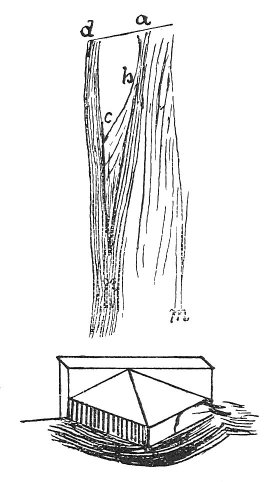

  
[Intangible Textual Heritage](../../index)  [Age of Reason](../index) 
[Index](index)   
[XVI. Physical Geography Index](dvs019)  
  [Previous](0972)  [Next](0974) 

------------------------------------------------------------------------

[Buy this Book at
Amazon.com](https://www.amazon.com/exec/obidos/ASIN/0486225739/internetsacredte)

------------------------------------------------------------------------

*The Da Vinci Notebooks at Intangible Textual Heritage*

### 973.

p. 202

 

When the fulness of rivers is diminished, then the acute angles formed
at the junction of their branches become shorter at the sides and wider
at the point; like the current *a n* and the current *d n*, which unite
in *n* when the river is at its greatest fulness. I say, that when it is
in this condition if, before the fullest time, *d n* was lower than *a
n*, at the time of fulness *d n* will be full of sand and mud. When the
water *d n* falls, it will carry away the mud and remain with a lower
bottom, and the channel *a n* finding itself the higher, will fling its
waters into the lower, *d n*, and will wash away all the point of the
sand-spit *b n c*, and thus the angle *a c d* will remain larger than
the angle *a n d* and the sides shorter, as I said before.

 [515](#fn_181)

------------------------------------------------------------------------

### Footnotes

[202:515](0973.htm#fr_181) : Above the first
sketch we find, in the original, this note: "*Sopra il pote rubaconte
alla torricella*"; and by the second, which represents a pier of a
bridge, "*Sotto l'ospedal del ceppo.*"

------------------------------------------------------------------------

[Next: 974.](0974)
