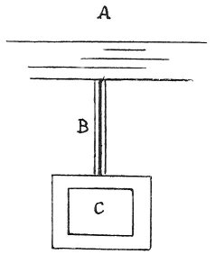

  
[Intangible Textual Heritage](../../index)  [Age of Reason](../index) 
[Index](index)   
[XVII. Topographical Notes Index](dvs020)  
  [Previous](1016)  [Next](1018) 

------------------------------------------------------------------------

[Buy this Book at
Amazon.com](https://www.amazon.com/exec/obidos/ASIN/0486225739/internetsacredte)

------------------------------------------------------------------------

*The Da Vinci Notebooks at Intangible Textual Heritage*

### 1017.

 

The moat of Milan.

Canal 2 braccia wide.

The castle with the moats full.

The filling of the moats of the Castle of Milan.

------------------------------------------------------------------------

[Next: 1018.](1018)
