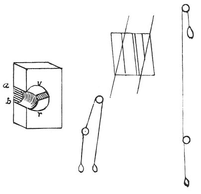

  
[Intangible Textual Heritage](../../index)  [Age of Reason](../index) 
[Index](index)   
[XVII. Topographical Notes Index](dvs020)  
  [Previous](1018)  [Next](1020) 

------------------------------------------------------------------------

[Buy this Book at
Amazon.com](https://www.amazon.com/exec/obidos/ASIN/0486225739/internetsacredte)

------------------------------------------------------------------------

*The Da Vinci Notebooks at Intangible Textual Heritage*

### 1019.

p. 234

 

In the Cathedral at the pulley of the nail of the cross.

Item.

To place the mass *v r* in the...

 [545](#fn_211)

------------------------------------------------------------------------

### Footnotes

[234:545](1019.htm#fr_211) : On this passage
AMORETTI remarks *(Memorie Storiche* chap. IX): *Nell'anno stesso lo
veggiamo formare un congegno di carucole e di corde, con cui trasportare
in piu venerabile e piu sicuro luogo, cioe nell'ultima arcata della nave
di mezzo della metropolitana, la sacra reliquia del Santo Chiodo, che
ivi ancor si venera. Al fol. 15 del codice segnato Q. R. in 16, egli ci
ha lasciata di tal congegno una doppia figura, cioe una di quattro
carucole, e una di tre colle rispettive corde, soggiugnandovi: in Domo
alla carucola del Chiodo della Croce.*

AMORETTI'S views as to the mark on the MS, and the date when it was
written are, it may be observed, wholly unfounded. The MS. L, in which
it occurs, is of the year 1502, and it is very unlikely that Leonardo
was in Milan at that time; this however would not prevent the remark,
which is somewhat obscure, from applying to the Cathedral at Milan.

------------------------------------------------------------------------

[Next: 1020.](1020)
