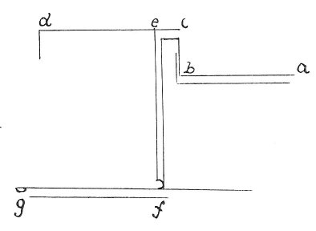

  
[Intangible Textual Heritage](../../index)  [Age of Reason](../index) 
[Index](index)   
[XVII. Topographical Notes Index](dvs020)  
  [Previous](1072)  [Next](1074) 

------------------------------------------------------------------------

[Buy this Book at
Amazon.com](https://www.amazon.com/exec/obidos/ASIN/0486225739/internetsacredte)

------------------------------------------------------------------------

*The Da Vinci Notebooks at Intangible Textual Heritage*

### 1073.

 

*c d* is the garden at Blois; *a b* is the conduit of Blois, made in
France by Fra Giocondo, *b c* is what is wanting in the height of that
conduit, *c d* is the height of the garden at Blois, *e f* is the siphon
of the conduit, *b c*, *e f*, *f g* is where the siphon discharges into
the river.  [589](#fn_255)

------------------------------------------------------------------------

### Footnotes

[250:589](1073.htm#fr_255) : The tenor of this
note (see lines 2 and 3) seems to me to indicate that this passage was
not written in France, but was written from oral information. We have no
evidence as to when this note may have been written beyond the
circumstance that Fra Giocondo the Veronese Architect left France not
before the year 1505. The greater part of the magnificent Chateau of
Blois has now disappeared. Whether this note was made for a special
purpose is uncertain. The original form and extent of the Chateau is
shown in Androvet, *Les plus excellents Bastiments de France, Paris
MDCVII,* and it may be observed that there is in the middle of the
garden a Pavilion somewhat similar to that shown on [Pl.
LXXXVIII](pl088.htm#img_pl088) No. 7.

See S. DE LA SAUSSAYE, *Histoire du Chateau de Blois 4eme edition Blois
et Paris* p. 175: *En mariant sa fille ainee a Francois, comte
d'Angouleme, Louis XII lui avait constitue en dot les comtes de Blois,
d'Asti, de Coucy, de Montfort, d'Etampes et de Vertus. Une ordonnance de
Francois I. lui laissa en* 1516 *l'administration du comte de Blois.*

Le roi fit commencer, dans la meme annee, les travaux de celle belle
partie du chateau, connue sous le nom d'aile de Francois I, et dont nous
avons donne la description au commencement de ce livre. Nous trouvons en
effet, dans les archives du Baron de Foursanvault, une piece qui en fixe
parfaitement la date. On y lit: "Je, Baymon Philippeaux, commis par le
Roy a tenir le compte et fair le payement des bastiments, ediffices et
reparacions que le dit seigneur fait faire en son chastu de Blois,
confesse avoir eu et receu ... la somme de trois mille livres tournois
... le cinquieme jour de juillet, l'an mil cinq cent et seize. P. 24:
*Les jardins avaient ete decores avec beaucoup de luxe par les
differents possesseurs du chateau. Il ne reste de tous les batiments
qu'ils y eleverent que ceux des officiers charges de l'ad*ministration
et de la culture des jardins, et un pavilion carre en pierre et en
brique flanque de terrasses a chacun de ses angles. Quoique defigure par
des mesures elevees sur les terrasses, cet edifice est tris-digne
d'interet par l'originalite du plan, la decoration architecturale et le
souvenir d'Anne de Bretagne qui le fit construire. *Felibien describes
the garden as follows:* Le jardin haut etait fort bien dresse par grands
compartimens de toutes sortes de figures, avec des allees de meuriers
blancs et des palissades de coudriers. Deux grands berceaux de
charpenterie separoient toute la longueur et la largeur du jardin, et
dans les quatres angles des allees, ou ces berceaux se croissent, il y
auoit 4 cabinets, de mesme charpenterie ... Il y a pas longtemps qu'il y
auoit dans ce mesme jardin, a l'endroit ou se croissent les allees du
milieu, un edifice de figure octogone, de plus de 7 thoises de diametre
et de plus de neuf thoises de haut; avec 4 enfoncements en forme de
niches dans les 4 angles des allies. Ce bastiment.... esloit de
charpente mais d'un extraordinairement bien travaille. On y voyait
particulierement la cordiliere qui regnati tout autour en forme de
cordon. Car la Reyne affectait de la mettre nonseulement a ses armes et
a ses chiffres mais de la faire representer en divers manieres dans tous
les ouvrages qu'on lui faisait pour elle ... le bastiment estati couvert
en forme de dome qui dans son milieu avait encore un plus petit dome, ou
lanterne vitree au-dessus de laquelle estait une figure doree
representant Saint Michel. Les deux domes estoient proprement couvert
d'ardoise et de plomb dore par dehors; par dedans ils esloient
lambrissez d'une menuiserie tres delicate. Au milieu de ce Salon il y
avait un grand bassin octogone de marbre blanc, dont toutes les faces
estoient enrichies de differentes sculptures, avec les armes et les
chiffres du Roy Louis XII et de la Reine Anne, Dans ce bassin il y en
avait un autre pose sur un piedestal lequel auoit sept piedz de
diametre. Il estait de figure ronde a godrons, avec des masques et
d'autres ornements tres scauamment taillez. Du milieu de ce deuxiesme
bassin s'y levoit un autre petit piedestal qui portait un troisiesme
bassin de trois pieds de diametre, aussy parfaitement bien taille;
c'estoit de ce dernier bassin que jallissoit l'eau qui se rependoit en
suitte dans les deux autres bassins. Les beaux ouvrages faits d'un
marbre esgalement blanc et poli, furent brisez par la pesanteur de tout
l'edifice, que les injures de l'air renverserent de fond en comble.

------------------------------------------------------------------------

[Next: 1074.](1074)
