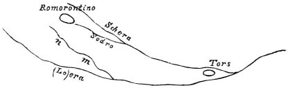

  
[Intangible Textual Heritage](../../index)  [Age of Reason](../index) 
[Index](index)   
[XVII. Topographical Notes Index](dvs020)  
  [Previous](1076)  [Next](1078) 

------------------------------------------------------------------------

[Buy this Book at
Amazon.com](https://www.amazon.com/exec/obidos/ASIN/0486225739/internetsacredte)

------------------------------------------------------------------------

*The Da Vinci Notebooks at Intangible Textual Heritage*

### 1077.

If the river *m n*, an affluant of the river Loire, were turned with its
muddy waters, into the river of Romorantin, this would fatten

p. 253

the land which it would water and would render the country fertile to
supply food to the inhabitants, and would make navigable canals for
mercantile purposes.

The way in which the river in its flow should scour its own channel.

 

By the ninth of the third; the more rapid it is, the more it wears away
its channel; and, by the converse proposition, the slower the water the
more it deposits that which renders it turbid.

And let the sluice be movable like the one I arranged in Friuli  [593](#fn_259) , where when one sluice was opened the
water which passed through it dug out the bottom. Therefore when the
rivers are flooded, the sluices of the mills ought to be opened in order
that the whole course of the river may pass through falls to each mill;
there should be many in order to give a greater impetus, and so all the
river will be scoured. And below the site of each of the two mills there
may be one of the said sluice falls; one of them may be placed below
each mill.

------------------------------------------------------------------------

### Footnotes

[253:593](1077.htm#fr_259) 19: This passage
reveals to us the fact that Leonardo had visited the country of Friuli
and that he had stayed there for some time. Nothing whatever was known
of this previously.

------------------------------------------------------------------------

[Next: 1078.](1078)
