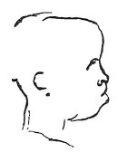

  
[Intangible Textual Heritage](../../index)  [Age of Reason](../index) 
[Index](index)   
[XVII. Topographical Notes Index](dvs020)  
  [Previous](1111)  [Next](dv20459) 

------------------------------------------------------------------------

[Buy this Book at
Amazon.com](https://www.amazon.com/exec/obidos/ASIN/0486225739/internetsacredte)

------------------------------------------------------------------------

*The Da Vinci Notebooks at Intangible Textual Heritage*

### 1112.

p. 270

 

 On the natives of hot countries.Men born
in hot countries love the night because it refreshes them and have a
horror of light because it burns them; and therefore they are of the
colour of night, that is black. And in cold countries it is just the
contrary.

 [616](#fn_282)

------------------------------------------------------------------------

### Footnotes

[270:616](1112.htm#fr_282) : The sketch here
inserted is in MS. H3 55b.

------------------------------------------------------------------------

[Next: Introduction](dv20459)
