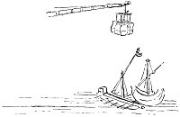

  
[Intangible Textual Heritage](../../index)  [Age of Reason](../index) 
[Index](index)   
[XVIII. Naval Warfare. Mechanical Appliances. Music. Index](dvs021)  
  [Previous](1114)  [Next](1116) 

------------------------------------------------------------------------

[Buy this Book at
Amazon.com](https://www.amazon.com/exec/obidos/ASIN/0486225739/internetsacredte)

------------------------------------------------------------------------

*The Da Vinci Notebooks at Intangible Textual Heritage*

### 1115.

[  
Click to enlarge](img/v227500.jpg)

 On naval warfare (1115. 1116).Supposing
in a battle between ships and galleys that the ships are victorious by
reason of the high of heir tops, you must haul the yard up almost to the
top of the mast, and at the extremity of the yard, that is the end which
is turned towards the enemy, have a small cage fastened, wrapped up
below and all round in a great mattress full of cotton so that it may
not be injured by the bombs; then, with the capstan, haul down the
opposite end of this yard and the top on the opposite side will go up so
high, that it will be far above the round-top of the ship, and you will
easily drive out the men that are in it. But it is necessary that the
men who are in the galley should go to the opposite side of it so as to
afford a counterpoise to the weight of the men placed inside the cage on
the yard.

------------------------------------------------------------------------

[Next: 1116.](1116)
