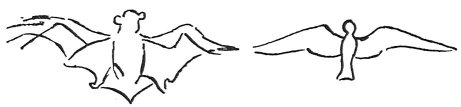

  
[Intangible Textual Heritage](../../index)  [Age of Reason](../index) 
[Index](index)   
[XVIII. Naval Warfare. Mechanical Appliances. Music. Index](dvs021)  
  [Previous](1122)  [Next](1124) 

------------------------------------------------------------------------

[Buy this Book at
Amazon.com](https://www.amazon.com/exec/obidos/ASIN/0486225739/internetsacredte)

------------------------------------------------------------------------

*The Da Vinci Notebooks at Intangible Textual Heritage*

### 1123.

Remember that your flying machine must imitate no other than the bat,
because the web is what by its union gives the armour, or strength to
the wings.

 

If you imitate the wings of feathered birds, you will find a much
stronger structure, because they are pervious; that is, their feathers
are separate and the air passes through them. But the bat is aided by
the web that connects the whole and is not pervious.

------------------------------------------------------------------------

[Next: 1124.](1124)
