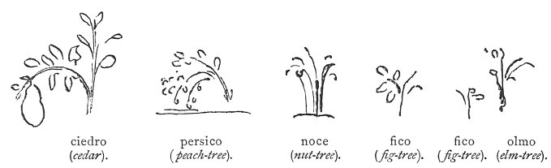

  
[Intangible Textual Heritage](../../index)  [Age of Reason](../index) 
[Index](index)   
[XX. Humorous Writings Index](dvs024)  
  [Previous](1274)  [Next](1276) 

------------------------------------------------------------------------

[Buy this Book at
Amazon.com](https://www.amazon.com/exec/obidos/ASIN/0486225739/internetsacredte)

------------------------------------------------------------------------

*The Da Vinci Notebooks at Intangible Textual Heritage*

### 1275.

 Fables on plants (1275-1279).The cedar,
being desirous of producing a fine and noble fruit at its summit, set to
work to form it with all the strength of its sap. But this fruit, when
grown, was the cause of the tall and upright tree-top being bent over.

The peach, being envious of the vast quantity of fruit which she saw
borne on the nut-tree, her neighbour, determined to do the same, and
loaded herself with her own in such a way that the weight of the fruit
pulled her up by the roots and broke her down to the ground.

 

The nut-tree stood always by a road side displaying the wealth of its
fruit to the passers by, and every one cast stones at it.

The fig-tree, having no fruit, no one looked at it; then, wishing to
produce fruits that it might be praised by men, it was bent and broken
down by them.

The fig-tree, standing by the side of the elm and seeing that its boughs
were bare of fruit, yet that it had the audacity to keep the Sun from
its own unripe figs with its branches, said to it: "Oh elm! art thou not
ashamed to stand in front of me. But wait till my offspring are fully
grown and you will see where you are!" But when her offspring were
mature, a troop of soldiers coming by fell upon the fig-tree and her

p. 342

figs were all torn off her, and her boughs cut away and broken. Then,
when she was thus maimed in all her limbs, the elm asked her, saying: "O
fig-tree! which was best, to be without offspring, or to be brought by
them into so miserable a plight!"

------------------------------------------------------------------------

[Next: 1276.](1276)
