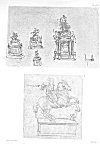

  
[Intangible Textual Heritage](../../index)  [Age of Reason](../index) 
[Index](index)  [Next](v2cont) 

------------------------------------------------------------------------

[Buy this Book at
Amazon.com](https://www.amazon.com/exec/obidos/ASIN/0486225739/internetsacredte)

------------------------------------------------------------------------

*The Da Vinci Notebooks at Intangible Textual Heritage*

[  
Click to enlarge](img/pl065.jpg)  
Plate LXV  

### The Notebooks of Leonardo Da Vinci

### Originally published as

### The Literary Works of Leonardo Da Vinci

### Translated by Jean Paul Richter

### Volume II

### \[1883\]

These files are based on material produced for Project Gutenberg by
Distributed Proofing. Additional scanning, proofing and formatting at
Intangible Textual Heritage, April 2006. Images scanned and processed at
Intangible Textual Heritage. This text and the associated images are in
the public domain in the United States because they were originally
published prior to January 1, 1923. These files may be used for any
non-commercial purpose provided that proper attribution of the source is
included with any copies.

------------------------------------------------------------------------

[Next: Contents of Volume II](v2cont)
