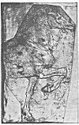

  
[Intangible Textual Heritage](../../index)  [Age of Reason](../index) 
[Index](index)   
[XI. The Notes on Sculpture Index](dvs013)  
  [Previous](v2illu)  [Next](0706) 

------------------------------------------------------------------------

[Buy this Book at
Amazon.com](https://www.amazon.com/exec/obidos/ASIN/0486225739/internetsacredte)

------------------------------------------------------------------------

*The Da Vinci Notebooks at Intangible Textual Heritage*

p. 1

### *XI.*

### *The notes on Sculpture.*

*Compared with the mass of manuscript treating of Painting, a very small
number of passages bearing on the practice and methods of Sculpture are
to be found scattered through the note books; these are here given at
the beginning of this section (Nos. 706-709). There is less cause for
surprise at finding that the equestrian statue of Francesco Sforza is
only incidentally spoken of; for, although Leonardo must have worked at
it for a long succession of years, it is not in the nature of the case
that it could have given rise to much writing. We may therefore regard
it as particularly fortunate that no fewer than thirteen notes in the
master's handwriting can be brought together, which seem to throw light
on the mysterious history of this famous work. Until now writers on
Leonardo were acquainted only with the passages numbered* 712, 719, 720,
722 *and* 723.

*In arranging these notes on sculpture I have given the precedence to
those which treat of the casting of the monument, not merely because
they are the fullest, but more especially with a view to reconstructing
the monument, an achievement which really almost lies within our reach
by combining and comparing the whole of the materials now brought to
light, alike in notes and in sketches.*

*A good deal of the first two passages, Nos.* 710 *and* 711*, which
refer to this subject seems obscure and incomprehensible; still, they
supplement each other and one contributes in no small degree to the
comprehension of the other. A very interesting and instructive
commentary on these passages may be found in the fourth chapter of
Vasari's*

p. 2

\[paragraph continues\] *Introduzione
della Scultura under the title* "Come si fanno i modelli per fare di
bronzo le figure grandi e picciole, e come le forme per buttarle; come
si armino di ferri, e come si gettino di metallo," *&c Among the
drawings of models of the moulds for casting we find only one which
seems to represent the horse in the act of galloping--No. 713. All the
other designs show the horse as pacing quietly and as these studies of
the horse are accompanied by copious notes as to the method of casting,
the question as to the position of the horse in the model finally
selected, seems to be decided by preponderating evidence.* "Il cavallo
dello Sforza"*--C. Boito remarks very appositely in the Saggio on page
26,* "doveva sembrare fratello al cavallo del Colleoni. E si direbbe che
questo fosse figlio del cavallo del Gattamelata, il quale pare figlio di
uno dei quattro cavalli che stavano forse sull' Arco di Nerone in Roma"
*(now at Venice). The publication of the Saggio also contains the
reproduction of a drawing in red chalk, representing a horse walking to
the left and supported by a scaffolding, given here on [Pl.
LXXVI](pl076.htm#img_pl076), No. 1. It must remain uncertain whether
this represents the model as it stood during the preparations for
casting it, or whether--as seems to me highly improbable--this sketch
shows the model as it was exhibited in* 1493 *on the Piazza del Castello
in Milan under a triumphal arch, on the occasion of the marriage of the
Emperor Maximilian to Bianca Maria Sforza. The only important point here
is to prove that strong evidence seems to show that, of the numerous
studies for the equestrian statue, only those which represent the horse
pacing agree with the schemes of the final plans.*

*The second group of preparatory sketches, representing the horse as
galloping, must therefore be considered separately, a distinction which,
in recapitulating the history of the origin of the monument seems
justified by the note given under No.* 720.

*Galeazza Maria Sforza was assassinated in* 1476 *before his scheme for
erecting a monument to his father Francesco Sforza could be carried into
effect. In the following year Ludovico il Moro the young aspirant to the
throne was exiled to Pisa, and only returned to Milan in* 1479 *when he
was Lord (Governatore) of the State of Milan, in* 1480 *after the
minister Cecco Simonetta had been murdered. It may have been soon after
this that Ludovico il Moro announced a competition for an equestrian
statue, and it is tolerably certain that Antonio del Pollajuolo took
part in it, from this passage in Vasari's Life of this artist:* "E si
trovò, dopo la morte sua, il disegno e modello che a Lodovico Sforza
egli aveva fatto per la statua a cavallo di Francesco Sforza, duca di
Milano; il quale disegno è nel nostro Libro, in due modi: in uno egli ha
sotto Verona; nell'altro, egli tutto armato, e sopra un basamento pieno
di battaglie, fa saltare il cavallo addosso a un armato; ma la cagione
perche non mettesse questi disegni in opera, non ho gia potuto sapere."
*One of Pollajuolo's drawings, as here described, has lately been
discovered by Senatore Giovanni Morelli in the Munich Pinacothek. Here
the profile of the horseman is a portrait of Francesco Duke of Milan,
and under the horse, who is galloping to the left, we see a warrior
thrown and lying on the ground; precisely the same idea as we find*

p. 3

*in some of Leonardo's designs for the monument, as on [Pl.
LXVI](pl066.htm#img_pl066), [LXVII](pl067.htm#img_pl067),
[LXVIII](pl068.htm#img_pl068), [LXIX](pl069.htm#img_pl069) and
[LXXII](pl072.htm#img_pl072) No.* 1*; and, as it is impossible to
explain this remarkable coincidence by supposing that either artist
borrowed it from the other, we can only conclude that in the terms of
the competition the subject proposed was the Duke on a horse in full
gallop, with a fallen foe under its hoofs.*

*Leonardo may have been in the competition there and then, but the means
for executing the monument do not seem to have been at once forthcoming.
It was not perhaps until some years later that Leonardo in a letter to
the Duke (No. 719) reminded him of the project for the monument. Then,
after he had obeyed a summons to Milan, the plan seems to have been so
far modified, perhaps in consequence of a remonstrance on the part of
the artist, that a pacing horse was substituted for one galloping, and
it may have been at the same time that the colossal dimensions of the
statue were first decided on. The designs given on [Pl.
LXX](pl070.htm#img_pl070), [LXXI](pl071.htm#img_pl071),
[LXXII](pl072.htm#img_pl072), 2 and 3, [LXXIII](pl073.htm#img_pl073) and
[LXXIV](pl074.htm#img_pl074) and on pp. 4 and 24, as well as three
sketches on [Pl. LXIX](pl069.htm#img_pl069) may be studied with
reference to the project in its new form, though it is hardly possible
to believe that in either of these we see the design as it was actually
carried out. It is probable that in Milan Leonardo worked less on
drawings, than in making small models of wax and clay as preparatory to
his larger model. Among the drawings enumerated above, one in black
chalk, [Pl. LXXIII](pl073.htm#img_pl073)--the upper sketch on the right
hand side, reminds us strongly of the antique statue of Marcus Aurelius.
If, as it would seem, Leonardo had not until then visited Rome, he might
easily have known this statue from drawings by his former master and
friend Verrocchio, for Verrocchio had been in Rome for a long time
between* 1470 *and* 1480*. In* 1473 *Pope Sixtus IV had this antique
equestrian statue restored and placed on a new pedestal in front of the
church of San Giovanni in Luterano. Leonardo, although he was painting
independently as early as in* 1472 *is still spoken of as working in
Verrocchio's studio in* 1477*. Two years later the Venetian senate
decided on erecting an equestrian statue to Colleoni; and as Verrocchio,
to whom the work was entrusted, did not at once move from Florence to
Venice--where he died in 1488 before the casting was completed--but on
the contrary remained in Florence for some years, perhaps even till*
1485*, Leonardo probably had the opportunity of seeing all his designs
for the equestrian statue at Venice and the red chalk drawing on [Pl.
LXXIV](pl074.htm#img_pl074) may be a reminiscence of it.*

*The pen and ink drawing on [Pl. LXXII](pl072.htm#img_pl072), No.* 3*,
reminds us of Donatello's statue of Gattamelata at Padua. However it
does not appear that Leonardo was ever at Padua before* 1499*, but we
may conclude that he took a special interest in this early bronze statue
and the reports he could procure of it, form an incidental remark which
is to be found in C. A. 145a; 432a, and which will
be given in Vol. II under* Ricordi *or Memoranda.*

p. 4

\[paragraph continues\] *Among the
studies--in the widest sense of the word--made in preparation statue we
may include the Anatomy of the Horse which Lomazzo and Vas mention; the
most important parts of this work still exist in the Queen's Library at*

[  
Click to enlarge](img/v200400.jpg)

\[paragraph continues\] *Windsor. It was
beyond a doubt compiled by Leonardo when at Milan; only interesting
records to be found among these designs are reproduced in Nos. 716a but
it must be pointed out that out of 40 sheets of studies of the movements
of the belonging to that treatise, a horse in full gallop occurs but
once.*

p. 5

*If we may trust the account given by Paulus Jovius--about l527--
Leonardo's horse was represented as "vehementer incitatus et anhelatus".
Jovius had probably seen the model exhibited at Milan; but, need we, in
fact, infer from this description that the horse was galloping? Compare
Vasari's description of the Gattamelata monument at Padua:* "Egli
\[Donatello\] vi ando ben volentieri, e fece il cavallo di bronzo, che e
in sulla piazza di Sant Antonio, nel quale si dimostra lo sbuffamento ed
il fremito del cavallo, ed il grande animo e la fierezza
vivacissimamente espressa dall'arte nella figura che lo cavalca".

*These descriptions, it seems to me, would only serve to mark the
difference between the work of the middle ages and that of the
renaissance.*

*We learn from a statement of Sabba da Castiglione that, when Milan was
taken by the French in* 1499*, the model sustained some injury; and this
informant, who, however is not invariably trustworthy, adds that
Leonardo had devoted fully sixteen years to this work (*la forma del
cavallo, intorno a cui Leonardo avea sedici anni continui consumati*).
This often-quoted passage has given ground for an assumption, which has
no other evidence to support it, that Leonardo had lived in Milan ever
since 1483. But I believe it is nearer the truth to suppose that this
author's statement alludes to the fact that about sixteen years must
have past since the competition in which Leonardo had taken part.*

*I must in these remarks confine myself strictly to the task in hand and
give no more of the history of the Sforza monument than is needed to
explain the texts and drawings I have been able to reproduce. In the
first place, with regard to the drawings, I may observe that they are
all, with the following two exceptions, in the Queen's Library at
Windsor Castle; the red chalk drawing on [Pl.
LXXVI](pl076.htm#img_pl076) No.* 1 *is in the MS. C. A. (see No. 7l2)
and the fragmentary pen and ink drawing on page* 4 *is in the Ambrosian
Library. The drawings from Windsor on [Pl. LXVI](pl066.htm#img_pl066)
have undergone a trifling reduction from the size of the originals.*

*There can no longer be the slightest doubt that the well-known
engraving of several horsemen (Passavant, Le Peintre-Graveur, Vol. V,
p.* 181*, No.* 3*) is only a copy after original drawings by Leonardo,
executed by some unknown engraver; we have only to compare the engraving
with the facsimiles of drawings on [Pl. LXV](dv20000.htm#img_pl065),
No.* 2*, Pl. [LXVII](pl067.htm#img_pl067), [LXVIII](pl068.htm#img_pl068)
and [LXIX](pl069.htm#img_pl069) which, it is quite evident, have served
as models for the engraver.*

*On [Pl. LXV](dv20000.htm#img_pl065) No.* 1*, in the larger sketch to
the right hand, only the base is distinctly visible, the figure of the
horseman is effaced. Leonardo evidently found it unsatisfactory and
therefore rubbed it out.*

*The base of the monument--the pedestal for the equestrian statue--is
repeatedly sketched on a magnificent plan. In the sketch just mentioned
it has the character of a shrine or aedicula to contain a sarcophagus.
Captives in chains are here represented on the entablature with their
backs turned to that portion of the monument which more*

p. 6

*strictly constitutes the pedestal of the horse. The lower portion of
the aedicula is surrounded by columns. In the pen and ink drawing [Pl.
LXVI](pl066.htm#img_pl066)--the lower drawing on the right hand
side--the sarcophagus is shown between the columns, and above the
entablature is a plinth on which the horse stands. But this arrangement
perhaps seemed to Leonardo to lack solidity, and in the little sketch on
the left hand, below, the sarcophagus is shown as lying under an arched
canopy. In this the trophies and the captive warriors are detached from
the angles. In the first of these two sketches the place for the
trophies is merely indicated by a few strokes; in the third sketch on
the left the base is altogether broader, buttresses and pinnacles having
been added so as to form three niches. The black chalk drawing on [Pl.
LXVIII](pl068.htm#img_pl068) shows a base in which the angles are formed
by niches with pilasters. In the little sketch to the extreme left on
[Pl. LXV](dv20000.htm#img_pl065), No.* 1*, the equestrian statue serves
to crown a circular temple somewhat resembling Bramante's tempietto of
San Pietro in Montario at Rome, while the sketch above to the right
displays an arrangement faintly reminding us of the tomb of the
Scaligers in Verona. The base is thus constructed of two platforms or
slabs, the upper one considerably smaller than the lower one which is
supported on flying buttresses with pinnacles.*

*On looking over the numerous studies in which the horse is not
galloping but merely walking forward, we find only one drawing for the
pedestal, and this, to accord with the altered character of the statue,
is quieter and simpler in style ([Pl. LXXIV](pl074.htm#img_pl074)). It
rises almost vertically from the ground and is exactly as long as the
pacing horse. The whole base is here arranged either as an independent
baldaquin or else as a projecting canopy over a recess in which the
figure of the deceased Duke is seen lying on his sarcophagus; in the
latter case it was probably intended as a tomb inside a church. Here,
too, it was intended to fill the angles with trophies or captive
warriors. Probably only No.* 724 *in the text refers to the work for the
base of the monument.*

*If we compare the last mentioned sketch with the description of a plan
for an equestrian monument to Gian Giacomo Trivulzio (No.* 725*) it
seems by no means impossible that this drawing is a preparatory study
for the very monument concerning which the manuscript gives us detailed
information. We have no historical record regarding this sketch nor do
the archives in the Trivulzio Palace give us any information. The simple
monument to the great general in San Nazaro Maggiore in Milan consists
merely of a sarcophagus placed in recess high on the wall of an
octagonal chapel. The figure of the warrior is lying on the sarcophagus,
on which his name is inscribed; a piece of sculpture which is certainly
not Leonardo's work. Gian Giacomo Trivulzio died at Chartres in* 1518*,
only five months before Leonardo, and it seems to me highly improbable
that this should have been the date of this sketch; under these
circumstances it would have been done under the auspices of Francis I,
but the Italian general was certainly not in favour with the French
monarch at the time. Gian Giacomo Trivulzio was a sworn foe to Ludovico
il Moro, whom he strove for years to overthrow. On the 6th
September* 1499 *he marched victorious into Milan at the head*

p. 7

*of a French army. In a short time, however, he was forced to quit Milan
again when Ludovico il Moro bore down upon the city with a force of
Swiss troops. On the 15th of April following, after defeating
Lodovico at Novara, Trivulzio once more entered Milan as a Conqueror,
but his hopes of becoming* Governatore *of the place were soon wrecked
by intrigue. This victory and triumph, historians tell us, were
signalised by acts of vengeance against the dethroned Sforza, and it
might have been particularly flattering to him that the casting and
construction of the Sforza monument were suspended for the time.*

*It must have been at this moment--as it seems to me--that he
commissioned the artist to prepare designs for his own monument, which
he probably intended should find a place in the Cathedral or in some
other church. He, the husband of Margherita di Nicolino Colleoni, would
have thought that he had a claim to the same distinction and public
homage as his less illustrious connection had received at the hands of
the Venetian republic. It was at this very time that Trivulzio had a
medal struck with a bust portrait of himself and the following
remarkable inscription on the reverse:* ** DEO FAVENTE • 1499 • DICTVS •
IO • IA • EXPVLIT • LVDOVICV • SF •** (Sfortiam) **DVC•** (ducem)
**MLI** (Mediolani)•**NOIE** (nomine)**• REGIS • FRANCORVM • EODEM • ANN
•**;(anno) **RED'T** (redit)**• LVS** (Ludovicus •**SVPERATVS ET CAPTVS
• EST • AB • EO**. *In the Library of the Palazzo Trivulzio there is a
MS. of Callimachus Siculus written at the end of the XVth or beginning
of the XVIth century. At the beginning of this MS. there is an exquisite
illuminated miniature of an equestrian statue with the name of the
general on the base; it is however very doubtful whether this has any
connection with Leonardo's design.*

*Nos.* 731-740*, which treat of casting bronze, have probably a very
indirect bearing on the arrangements made for casting the equestrian
statue of Francesco Sforza. Some portions evidently relate to the
casting of cannon. Still, in our researches about Leonardo's work on the
monument, we may refer to them as giving us some clue to the process of
bronze casting at that period.*

------------------------------------------------------------------------

[Next: 706.](0706)
