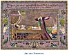

  
[Intangible Textual Heritage](../../index)  [Asia](../index) 
[Myths/Legends](../../neu/index)  [Index](index)  [Previous](alp22) 
[Next](alp24) 

------------------------------------------------------------------------

*Armenian Legends and Poems* \[1916\] at Intangible Textual Heritage

------------------------------------------------------------------------

p. 23

[  
Click to enlarge](img/02300.jpg)  
ARA AND SEMIRAMIS  

### ARA AND SEMIRAMIS

##### From the History of Armenia,

###### by

##### MOSES OF KHORENE

FOR a few years before the death of Ninus, Ara reigned over Armenia
under his Protectorate, and found the same favour in his eyes as his
father Aram had done. But that wanton and lustful woman Semiramis,
having heard speak for many years of the beauty of Ara, wished to
possess him; only she ventured not to do anything openly. But after the
death or the escape to Crete of Ninus, as it hath been affirmed unto me,
she discovered her passion freely, and sent messengers to Ara the
Beautiful with gifts and offerings, with many prayers and promises of
riches; begging him to come to her to Nineveh and either wed her and
reign over all that Ninus had possessed, or fulfil her desires and
return in peace to Armenia, with many gifts.

And when the messengers had been and returned many times and Ara had not
consented, Semiramis became very wroth; and she arose and took all the
multitude of her hosts and hastened to the land of Armenia, against Ara.
But, as she had beforehand declared, it was not so much to kill him and
persecute him that she went, as to subdue him and bring him by force to
fulfil the desires of her passion. For having been consumed with desire
by what she had heard of him, on seeing him she became as one beside
herself. She arrived in this turmoil at the plains of Ara, called after
him Aïrarat. And when the battle was about to take place she commanded
her generals to devise some means of saving the life of Ara. But in the
fighting the army of Ara was beaten, and Ara died, being slain by the
warriors of Semiramis. And after the battle the Queen sent out to the
battlefield to search for the body of her beloved amongst those who had
died. And they found the body of Ara amongst the brave ones that had
fallen, and she commanded them to place it in an upper chamber in her
castle.

But when the hosts of Armenia arose once more against Queen Semiramis to
avenge the death of Ara, she said: "I have commanded the gods to lick
his wounds, and he shall live

p. 24

again." At the same time she thought to bring Ara back to life by
witchcraft and charms, for she was maddened by the intensity of her
desires. But when the body began to decay, she commanded them to cast it
into a deep pit, and to cover it. And having dressed up one of her men
in secret, she sent forth the fame of him thus: "The gods have licked
Ara and have brought him back to life again, thus fulfilling our prayers
and our pleasure. Therefore from this time forth shall they be the more
glorified and worshipped by us, for that they are the givers of joy and
the fulfillers of desire." She also erected a new statue in honour of
the gods and worshipped it with many sacrifices, showing unto all as if
the gods had brought Ara back to life again. And having caused this
report to be spread over all the land of Armenia and satisfied the
people she put an end to the fighting. And she took the son of Ara whom
his beloved wife Nouvart had borne unto him and who was but twelve years
old at the time of his father's death. And she called his name Ara in
memory of her love for Ara the Beautiful, and appointed him ruler over
the land of Armenia, trusting him in all things.

 

------------------------------------------------------------------------

[Next: Lament Over the Heroes Fallen in the Battle of Avarair](alp24)
