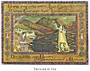

  
[Intangible Textual Heritage](../../index)  [Asia](../index) 
[Myths/Legends](../../neu/index)  [Index](index)  [Previous](alp61) 
[Next](alp63) 

------------------------------------------------------------------------

*Armenian Legends and Poems* \[1916\] at Intangible Textual Heritage

------------------------------------------------------------------------

p. 86

[  
Click to enlarge](img/08600.jpg)  
THE LAKE OF VAN  

### THE LAKE OF VAN

##### BY RAFFI

UNUTTERABLE silence here is spread  
On every hand, and Nature might be dead.  
A lonely exile, here I sit and weep,  
And far above, bright Moon, I see thee sweep.

From Earth's creation till the skies shall parch  
And she dissolve, thou circlest Heaven's high arch:  
Saw’st thou the laurels on Armenia's brow?  
And dost behold her hopeless sorrows now?

Mournful as I! I wonder dost thou see  
How she is ground by heels of tyranny!  
And do thine eyes with bitter tear-drops smart  
When barbèd arrows pierce her through the heart

Thy heart is stone, thy pity stark and cold,  
For fields of innocent blood thou dost behold  
Without a word, and o’er Armenia's land  
Thy nightly compass of the dome hast spanned  
With all the brightness that was thine of old.

     .        .        .        .        .        .

O Lake, make answer! Why be silent more?  
Wilt not lament with one whose heart is sore?  
And you, ye Zephyrs, hurl the waters high  
That I may feed them from a mourner's eye!

p. 87

A garden once, luxuriantly fair,  
Now is Armenia choked with thorn and tare:  
Thou who hast seen her fortunes wax and wane,  
Tell me, I pray thee! Must she thus remain?

Must this unhappy nation ever be  
By foreign princes held in slavery?  
Is the Armenian and his stricken race  
Counted unworthy in God's judgment-place?

Comes there a day, comes there a season that  
Shall hail a flag on topmost Ararat,  
Calling Armenians, wheresoe’er they roam,  
To seek once more their loved and beauteous home?

Hard tho’ it be, O heavenly Ruler, raise  
Armenia's spirit, and her heart's dark ways  
Light with Thy knowledge: understanding so  
The mystery of life, her works shall show  
That all she does is ordered to Thy praise.

     .        .        .        .        .        .

Then suddenly the surface of the lake  
Grew luminous, and from its depths did break  
A lovely maid that bore a lantern and  
A lyre of shining ivory in her hand.  
Was she an Angel in a strange disguise?  
Was she a Houri fled from Paradise?  
Nay, rather was she of the form and hue  
Of the Armenian Muses!  
                           "Tell me true,  
O Muse," I cried, "our people's destiny!  
Speak of the Now and of the Yet-to-be!"

p. 88

Then the sweet heavenly Spirit made reply,  
"Wipe, O sad youth, the salt tears from thine eye!  
I bring glad tidings: better days shall break,  
New days of joy, that carry in their wake  
The reign of God, Whose will is free and just:  
A Golden Age again shall gild the dust!

"Armenia's Muses shall awake anew,  
And her Parnassus bloom with vernal hue,  
And the bright car Apollo whirls on high  
Shall sweep the shadows from her clouded sky.

"For many a day, like thee, we mourned aloud  
While the thick darkness wrapped her in its shroud:  
Now, O belovèd, may the weeping cease,--  
To us has come the olive branch of peace!

"Cleanse from thy lute the rust that soils its string;  
Hasten thee back, and, as thou goest, sing  
Such joyful lays as yet may re-inspire  
Hearts that are dead with new and tameless fire.  
His Will is done; the Time is here; the Day  
Dawns; and the Morning Star, so God doth say,  
Shall be thy sign."  
                      Then darkness fell again;  
The vision fled; but long there did remain  
An echo of the thrilling voice, that blended  
With the wild waves whose depths she had descended;  
And flowery perfumes filled the air like rain.

O message dear, and sweet prophetic strain!  
What happiness is come to us, but Oh!  
Beautiful Muse, yet one thing would we know--  
Can a dead corpse rise up and live again?

                                      *Translated by G. M. Green*.

 

------------------------------------------------------------------------

[Next: Spring](alp63)
