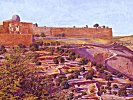

  
[Intangible Textual Heritage](../../index)  [Asia](../index) 
[Index](index)  [Previous](flhl14)  [Next](flhl16) 

------------------------------------------------------------------------

[Buy this Book at
Amazon.com](https://www.amazon.com/exec/obidos/ASIN/B0028Y4OOY/internetsacredte)

------------------------------------------------------------------------

  
*Folk-lore of the Holy Land, Moslem, Christian and Jewish*, by J. E.
Hanauer \[1907\], at Intangible Textual Heritage

------------------------------------------------------------------------

p. 76 p. 77

# SECTION II

### CONTAINING LEGENDS AND ANECDOTES POSSIBLY FOUNDED ON FACT

p. 78 p. 79

### SECTION II

### I

#### BÂB EL KHALÌL, THE JAFFA GATE AT JERUSALEM

IN Mohammedan eschatology Bâb el Khalìl figures as the Gate of Lydda
where ’Isa ibn Maryam will destroy Antichrist, though some amongst the
learned, for instance Abulfeda and Kemâl-ed-dìn, assert that the event
will take place near the entrance to the town of Lydda, and, as a matter
of fact, a well inside a small domed building situated about halfway
between Lydda and Ramleh, and called "Bir es Zeybak" or the Quicksilver
Well, is pointed out as the exact spot where the "Dejjâl" (lit.
impostor) or Antichrist will be slain.

Just inside the gateway, and on the left-hand side after passing the
portal, there are two cenotaphs in an enclosure behind an iron railing.
Old jars, and tins, saddles, etc., placed beside the cenotaphs, or piled
up in the corners of the open space around them, show that two "Welis"
or saints are buried here. As the once existing inscriptions are now
quite effaced, no one knows exactly who they were. Some think the tombs
are those of the two architect brothers under whose supervision the
present city

p. 80

wall was built in the early part of the sixteenth century. Others have
informed the writer that the monuments mark the graves of "Mûjahedìn,"
or warriors of Islam, in the days either of Bûkhtûnnussur
(Nebuchadnezzar) [1](#fn_36) or of Salah-ed-din
(Saladin), while still another story relates that the "wely" buried here
was a namesake and contemporary of Salah-ed-din who was in charge of the
gate when the Christians besieged the city, [2](#fn_37) and when he fell in the battle, his
severed head seized hold of his scimitar with its teeth, and kept the
Christians off seven days and nights.

Concerning Nebuchadnezzar, it is related that long before the
destruction of pre-exilic Jerusalem, Jeremiah or ’Ozair (Esdras), the
prophet, knew him as a starving lad, afflicted with a scabby head, and
covered with vermin. Having foretold his future greatness, the prophet
obtained from the youth a letter of "Amân" or safety for himself and
particular friends to be available at the time when the disasters
predicted by the prophet should come upon the unhappy Beyt-el-Makdas.
When, many years later, Jeremiah heard that the Babylonian hosts were
actually on their way, he went down to Ramleh, presented the document to
Bûkhtûnnussur, and claimed the protection promised. This was granted;

p. 81

b when e prophet begged that the city and Temple might also be spared,
the invader said that he had received command from Allah to destroy
them.

In proof of his statement, he bade Jeremiah watch the flight of three
arrows which he shot at random. The first was aimed westwards, but
turned in an opposite direction and struck the roof of the Temple at
Jerusalem. The second arrow, which was pointed northwards, acted in the
same manner, and so also did the third, which was shot southwards. The
city and Temple were utterly destroyed, and the golden furniture of the
latter conveyed by Nebuchadnezzar's orders to Rome (*sic*).

’Ozair, however, received a promise from Allah that he should be
privileged to behold the restoration of Jerusalem. Passing the ruins one
day, with a donkey and a basket of figs, he could not help expressing a
doubt if this were possible, when Allah caused him to fall asleep for a
whole century, at the end of which he was restored to life and found the
city rebuilt, populous, and prosperous. The skeleton of his ass, being
restored to life and covered with flesh and skin, began to bray, and was
admitted into Paradise, as a reward to that one of its ancestors which
had been wrongfully beaten for refusing to convey Iblìs into the ark. On
beholding the resurrection of his donkey, ’Ozair was convinced that his
experiences were real and that he had actually been asleep for a hundred
years. He then, in obedience to the Divine command, entered Jerusalem
and instructed its inhabitants in Allah's Law. The very

p. 82

spot where the prophet slept so long is shown at El Edhemìeh, north of
the Holy City, in the large cave called Jeremiah's Grotto; and a story
like that of ’Ozair is read in the Greek churches during the service
appointed for November 4th, when the fall of Jerusalem is commemorated.

Jewish traditions state that the celebrated Hebrew poet, Rabbi Judah ha
Levi, of Toledo, [1](#fn_38) met his death at
this Bâb el Khalìl. From his earliest youth he had yearned to visit the
Holy Land and city, but had been prevented. At last, in his old age, the
obstacles in his path were removed. But he never entered Jerusalem. On
coming up to the gate he was seized with such emotion, that he
prostrated himself in the dust, and lay there weeping, heedless of
danger. A band of armed horsemen came galloping towards the town. The
old man neither saw nor heard them; and so rapid was their approach,
that before anyone had time either to warn or rescue the aged Jew, he
had been trampled to death.

Many of the orthodox Jews of Jerusalem believe that, concealed within
the gate-posts, there exists a "Mezûzah," or case like those to be seen
at the doorways of Jewish dwellings, placed here by the Almighty and
containing a parchment upon which are written, by the finger of God
Himself, the texts Deut. vi. 4-9 and xi. 13-21. In consequence of this
belief

p. 83

many pious Jews, at passing in or out, touch the gate-post lightly and
reverently, and then kiss their fingers.

------------------------------------------------------------------------

### Footnotes

[80:1](flhl15.htm#fr_36) Nebuchadnezzar and
Titus are often confused by Moslem Arabs. Thus St John the Baptist's
blood is said to have continued walling up like a fountain under the
great altar till the Temple was destroyed by Bûkhtûnnussur, and even
then not to have stopped till Bûkhtûnnussur had slain a thousand
Jews.--ED.

[80:2](flhl15.htm#fr_37) Which, by the way, did
not happen in the time of Salah-ed-din; it was the other way about.

[82:1](flhl15.htm#fr_38) The author of many
hymns, and particularly of the elegies for the 9th day of Ab,
anniversary of the death of Moses, as also of the destruction of
Jerusalem, first by Nebuchadnezzar, and then by Titus many centuries
later.

------------------------------------------------------------------------

[Next: II. Turbet Birket Mamilla](flhl16)
