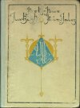
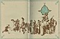
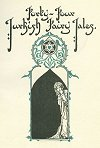
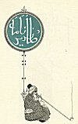
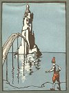
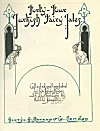
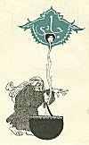

  
[Intangible Textual Heritage](../../index)  [Asia](../index) 
[Index](index)  [Next](ftft01) 

------------------------------------------------------------------------

Forty-four Turkish Fairy Tales \[1913\], at Intangible Textual Heritage

------------------------------------------------------------------------

# Forty-Four Turkish Fairy Tales

## Collected and translated by Dr. Ignácz Kúnos

##### with illustrations by

### Willy Pogany.

#### George G. Harrap & Co. London

#### \[1913\]

Scanned at Intangible Textual Heritage, August 2006. Proofed and
formatted by John Bruno Hare. This text is in the public domain in the
United States because it was published prior to January 1st, 1923. These
files may be used for any non-commercial purpose, provided this notice
of attribution is left intact in all copies.

[  
Click to enlarge](img/cover.jpg)  
Cover  

[  
Click to enlarge](img/spine.jpg)  
Spine  

[  
Click to enlarge](img/endp.jpg)  
End Papers  

[  
Click to enlarge](img/_00100.jpg)

[  
Click to enlarge](img/_00200.jpg)

[  
Click to enlarge](img/front.jpg)  
Frontispiece  

[  
Click to enlarge](img/title.jpg)  
Title Page  

[  
Click to enlarge](img/_00400.jpg)

------------------------------------------------------------------------

[Next: Contents](ftft01)
