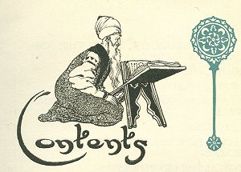

  
[Intangible Textual Heritage](../../index)  [Asia](../index) 
[Index](index)  [Previous](ftft00)  [Next](ftft02) 

------------------------------------------------------------------------

Forty-four Turkish Fairy Tales \[1913\], at Intangible Textual Heritage

------------------------------------------------------------------------

p. v

 

|                                                        |                            |
|--------------------------------------------------------|----------------------------|
|                                                        | PAGE                       |
| PREFACE                                                | ix                         |
| THE CREATION                                           | [1](ftft03.htm#page_1)     |
| THE BROTHER AND SISTER                                 | [3](ftft04.htm#page_3)     |
| FEAR                                                   | [12](ftft05.htm#page_12)   |
| THE THREE ORANGE PERIS                                 | [19](ftft06.htm#page_19)   |
| THE ROSE-BEAUTY                                        | [31](ftft07.htm#page_31)   |
| THE SILENT PRINCESS                                    | [39](ftft08.htm#page_39)   |
| KARA MUSTAFA THE HERO                                  | [50](ftft09.htm#page_50)   |
| THE WIZARD DERVISH                                     | [58](ftft10.htm#page_58)   |
| THE FISH-PERI                                          | [64](ftft11.htm#page_64)   |
| THE HORSE-DEW AND THE WITCH                            | [70](ftft12.htm#page_70)   |
| p. vi                        |                            |
|                                                        | Page                       |
| THE SIMPLETON                                          | [77](ftft13.htm#page_77)   |
| THE MAGIC TURBAN, THE MAGIC WHIP, AND THE MAGIC CARPET | [87](ftft14.htm#page_87)   |
| MAHOMET, THE BALD-HEAD                                 | [95](ftft15.htm#page_95)   |
| THE STORM FIEND                                        | [102](ftft16.htm#page_102) |
| THE LAUGHING APPLE AND THE WEEPING APPLE               | [117](ftft17.htm#page_117) |
| THE CROW-PERI                                          | [126](ftft18.htm#page_126) |
| THE FORTY PRINCES AND THE SEVEN-HEADED DRAGON          | [133](ftft19.htm#page_133) |
| KAMER-TAJ, THE MOON-HORSE                              | [141](ftft20.htm#page_141) |
| THE BIRD OF SORROW                                     | [150](ftft21.htm#page_150) |
| THE ENCHANTED POMEGRANATE BRANCH AND THE BEAUTY        | [159](ftft22.htm#page_159) |
| THE MAGIC HAIRPINS                                     | [174](ftft23.htm#page_174) |
| PATIENCE-STONE AND PATIENCE-KNIFE                      | [182](ftft24.htm#page_182) |
| THE DRAGON-PRINCE AND THE STEPMOTHER                   | [188](ftft25.htm#page_188) |
| THE MAGIC MIRROR                                       | [198](ftft26.htm#page_198) |
| THE IMP OF THE WELL                                    | [206](ftft27.htm#page_206) |
| THE SOOTHSAYER                                         | [213](ftft28.htm#page_213) |
| THE DAUGHTER OF THE PADISHAH OF KANDAHAR               | [217](ftft29.htm#page_217) |
| SHAH MERAM AND SULTAN SADE                             | [228](ftft30.htm#page_228) |
| p. vii                      |                            |
|                                                        | Page                       |
| THE WIZARD AND HIS PUPIL                               | [238](ftft31.htm#page_238) |
| THE PADISHAH OF THE THIRTY PERIS                       | [243](ftft32.htm#page_243) |
| THE DECEIVER AND THE THIEF                             | [250](ftft33.htm#page_250) |
| THE SNAKE-PERI AND THE MAGIC MIRROR                    | [257](ftft34.htm#page_257) |
| LITTLE HYACINTH'S KIOSK                                | [266](ftft35.htm#page_266) |
| PRINCE AHMED                                           | [274](ftft36.htm#page_274) |
| THE LIVER                                              | [286](ftft37.htm#page_286) |
| THE FORTUNE TELLER                                     | [290](ftft38.htm#page_290) |
| SISTER AND BROTHER                                     | [298](ftft39.htm#page_298) |
| SHAH JUSSUF                                            | [307](ftft40.htm#page_307) |
| THE BLACK DRAGON AND THE RED DRAGON                    | [316](ftft41.htm#page_316) |
| "MADJUN"                                               | [327](ftft42.htm#page_327) |
| THE FORLORN PRINCESS                                   | [334](ftft43.htm#page_334) |
| THE BEAUTIFUL HELWA MAIDEN                             | [342](ftft44.htm#page_342) |
| ASTROLOGY                                              | [351](ftft45.htm#page_351) |
| KUNTERBUNT                                             | [358](ftft46.htm#page_358) |
| MEANING OF TURKISH WORDS                               | [361](ftft47.htm#page_361) |

 

------------------------------------------------------------------------

[Next: Preface](ftft02)
