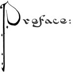

  
[Intangible Textual Heritage](../../index)  [Asia](../index) 
[Index](index)  [Previous](ftft01)  [Next](ftft03) 

------------------------------------------------------------------------

Forty-four Turkish Fairy Tales \[1913\], at Intangible Textual Heritage

------------------------------------------------------------------------

p. viii

 

p. ix

|                            |
|----------------------------|
|  |

|                     |
|---------------------|
|  |

THE stories comprising this collection have been culled with my own
hands in the many-hued garden of Turkish folklore. They have not been
gathered from books, for Turkey is not a literary land, and no books of
the kind exist; but, an attentive listener to "the storytellers" who
form a peculiar feature of the social life of the Ottomans, I have
jotted them down from time to time, and now present them, a choice
bouquet, to the English reading public. The stories are such as may be
heard daily in the purlieus of Stamboul, in the small rickety houses of
that essentially Turkish quarter of Constantinople where around the
tandir the native women relate them to their children and friends.

These tales are by no means identical with, nor do they even resemble,
those others that have been assimilated by the European consciousness
from Indian sources and the "Arabian Nights." All real Turkish fairy
tales are quite independent of those; rather are they related to the
Western type so far as their contents and structure are concerned.
Indeed, they may only be placed in the category of Oriental tales in
that they are permeated with the cult of Islam and that their characters
are Moslems. The kaftan encircling their bodies, the turban on their
heads, and the slippers on their feet, all proclaim their Eastern
origin. Their heroic deeds, their struggles and triumphs, are mostly
such as may be found in the folklore of any European people. It is but
natural that pagan superstition, inseparable from the ignorant, should
be always

p. x

cropping up in these stories. Like all real folklore they are not for
children, though it is the children who are most strongly attracted by
them, and after the children the women. They are mostly woven from the
webs of fancy in that delectable realm, Fairyland; since it is there
that everything wonderful happens, the dramatis person being as a rule
supernatural beings.

Nearly all Turkish stories belong to the category of fairy tales. These
marvellous scenes are enacted in that imaginary country wherein
Padishahs have multifarious relations with the rulers of the fairy
world. The Shahzadas, their sons, or the Sultanas, their daughters, are
either the only children of their parents, or else they appear as three
or seven brothers or sisters, whose careers are associated with
miraculous events from birth onward. Their kismet, or fate, is
controlled by all-powerful dervishes or peri-magicians. Throughout their
lives, peris, to the number of three, seven, or forty, are their
beneficent helpers; while dews, or imps, are the obstructors of their
happiness. Besides the dews, there are also ejderha, or dragons, with
three, seven, or more heads, to be encountered, and peris in the form of
doves to come to the rescue in the nick of time. Each of these
supernatural races has its separate realm abounding with spells and
enchantments. To obtain these latter, and to engage the assistance of
the peris, the princes of the fairy tales set out on long and perilous
journeys, during which we find them helped by good spirits (ins) and
attacked by evil ones (jins). These spirits appear sometimes as animals,
at others as flowers, trees, or the elements of nature, such as wind and
fire, rewarding the good and punishing the evil.

The fairyland of the Turks is approached by a threefold road; in most
cases the realm can be reached only on the back of a Pegasus, or by the
aid of the peris. One must either ascend to the seventh sphere above the
earth by the help of the anka-bird, or descend to the seventh sphere
below the earth by the help of a dew. A multitude of serais and kiosks
are at the disposal of the heroes of the tales; thousands of birds of
gayest

p. xi

plumage warble their tuneful lays, and in the flower-gardens the most
wonderful odours intoxicate the senses.

Turkish fairy tales are as crystal, reflecting the sun's rays in a
thousand dazzling colours; clear as a cloudless sky; and transparent
like the dew upon a budding rose. In short, Turkish fairy tales are not
the stories of the Thousand and One Nights, but of the Thousand and One
Days.

I. K.

 

------------------------------------------------------------------------

[Next: The Creation](ftft03)
