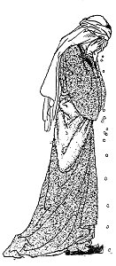
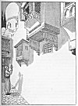
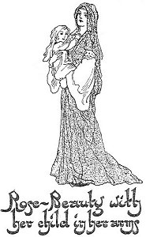
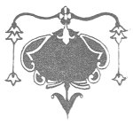

  
[Intangible Textual Heritage](../../index)  [Asia](../index) 
[Index](index)  [Previous](ftft06)  [Next](ftft08) 

------------------------------------------------------------------------

Forty-four Turkish Fairy Tales \[1913\], at Intangible Textual Heritage

------------------------------------------------------------------------

p. 31

 

|                     |
|---------------------|
|  |

N olden times, when the camel was a horse-dealer, the mouse a barber,
the cuckoo a tailor, the tortoise a baker, and the ass still a servant,
there was a miller who had a black cat. Besides this miller, there was a
Padishah who had three daughters, aged respectively forty, thirty, and
twenty years. The eldest went to the youngest and made her write a
letter to her father in these terms:

|                    |
|--------------------|
|  |

"Dear father, one of my sisters is forty, the other thirty, and they
have not yet married. Take notice that I will not wait so long before I
get a husband."

The Padishah on reading the letter sent for his daughters and thus
addressed them: "Here are a bow and arrow for each of you; go and shoot,
and wherever your arrows fall, there you will find your future
husbands."

Taking the weapons from their father, the three maidens went forth. The
eldest shot first, and her arrow fell in the palace of the Vezir's son;
she was accordingly united to him. The second daughter's arrow fell in
the palace of the son of the Sheikh-ul-Islam, and him she got for a
husband. When the youngest shot, however, her arrow fell into the hut of
a wood-cutter. "That doesn't count," cried everybody; and she shot
again. The second time the arrow fell in the same spot; and a third
attempt met no better success.

p. 32

The Shah was wrathful with his daughter on account of her letter, and
exclaimed: "you foolish creature, that serves you right. Your elder
sisters have waited patiently and are rewarded. You, the youngest, have
dared to write me that impertinent letter: you are justly punished. Take
your woodcutter and be off with you." So the poor girl left her father's
palace to be the wife of the woodcutter.

|                     |
|---------------------|
|  |

N the course of time a beautiful girl-baby was born to them. The
wood-cutter's wife bitterly lamented the fact that her child must have
so poor a home, but even while she wept three wonderful fairies stepped
through the wall of the hut into the dismal room where the child lay.
Standing by her cot, each in turn stretched out a hand over the sleeping
infant.

Said the first fairy: "Rose-Beauty shall she be called; and instead of
tears, pearls shall she shed."

Said the second fairy: "When she smiles, roses shall blossom." Said the
third: "Wherever her foot falls shall grass spring up!" Then the three
disappeared as they had come.

Years passed away. The child grew and attained her twelfth year,
developing such loveliness as none had ever seen before. To gaze once
upon her was to be filled with love for her. When she smiled roses
blossomed; when she wept pearls fell from her eyes, and grass grew
wherever her feet trod. The fame of her beauty spread far and wide.

The mother of a certain Prince heard of Rose-Beauty and resolved that
this maiden and no other should become her son's bride. She called her
son to her and told him that in the town was a maiden who smiled roses,
wept pearls, and under whose feet grass grew; he must see her.

The fairies had already shown the maid to the Prince in a dream, and
thus kindled in him the fire of love; but before his mother he was shy
and refused to seek the object of his passion. The Sultana therefore
insisted, and finally ordered a lady of the palace to accompany him on
his quest. They entered the hut, explained the purpose of their visit,
and in the name of Allah demanded the maiden for the Shahzada. The poor
people were

p. 33

overcome with joy at their good fortune; they promised their daughter,
and commenced preparations for her departure.

Now this palace-dame had a daughter, who somewhat resembled the
Rose-Beauty, and she was displeased that the Prince should marry a poor
girl instead of her own daughter. Accordingly she concocted a scheme to
deceive the people and bring about the Prince's marriage to her own
child. On the wedding-day she gave the woodcutter's daughter salt food
to eat, and took a jug of water and a large basket and put them in the
bridal coach wherein the Rose-Beauty, herself, and her daughter were
about to set out for the palace.

On the way the maiden, complaining of thirst, asked for a drink of
water. The palace-dame answered: "I shall give you no water unless you
give me an eye in exchange." Nearly dying of thirst, the maiden took out
one of her eyes and gave it to the cruel woman for a drink of water.

As they proceeded the torments of thirst again overcame the poor maiden,
and again she asked for water. "I will give you drink, but only in
exchange for your other eye," answered the woman. So great was her agony
that the victim yielded her other eye. No sooner had the woman got it in
her possession than she took the now sightless Rose-Beauty, bound her in
the basket, and had her carried to the top of a mountain.

The woman now hastened to the palace and presented her daughter, clad in
a gorgeous wedding garment, to the Prince, saying: "Here is your bride,"
The marriage was accordingly celebrated with great festivity; but when
the Prince came to lift his wife's veil he saw that she was not the one
revealed to him in his dream. As, however, she resembled the dream-bride
somewhat, he held his peace.

The Prince knew that the maiden of his dream wept pearls, smiled roses,
and that the grass grew under her feet; from this one, however, came
neither pearls, roses, nor grass, He suspected more than ever that he
had been deceived, but "I will soon find out" he thought to himself, and
spoke no word on the subject to anyone.

p. 34

Meanwhile the poor Rose-Beauty on the mountaintop wept and moaned,
pearls rolling down her cheeks from her sightless eye-sockets until the
basket in which she lay bound was filled to overflowing. A scavenger at
work on the road heard the sounds of grief and cried out in fear: "Who
is that, a spirit or a fairy?" The maiden answered: "Neither a spirit
nor a fairy, but a human being like yourself." 

|                                                    |
|----------------------------------------------------|
|  |

The scavenger, reassured, approached the basket, opened it, and saw the
blind girl and the pearls she had shed, He took her home to his
miserable hovel, and being alone in the world, adopted her as his own
child. But the maiden constantly bemoaned the loss of her eyes, and as
she was always weeping the man now had nothing else to do but gather the
pearls she shed and go out and sell them. Time rolled on. In the palace
was merriment, in the scavenger's hovel grief and pain. One day as the
Rose-Beauty was sitting at the door, she smiled at some pleasant
recollection, and forthwith a rose appeared. Said the maiden to the
scavenger: "Father, here is a rose; take it to the Prince's palace and
say thou hast a rose of a rare kind to sell. When the palace dame
appears, say it cannot be sold for money, but for a human eye." The man
took the rose, went to the palace and cried aloud: "A rose for sale; the
only one of its kind in the world."

Indeed, it was not the season for roses. The palace-dame, hearing the
scavenger's cry, resolved to buy the rose for her daughter, thinking
that when the Prince saw the flower in his wife's possession his
suspicions would be set at rest. Calling the poor man aside, she
inquired the price of the rose. "Money cannot buy it," replied the
scavenger, "but I will part

p. 35

[  
Click to enlarge](img/03500.jpg)  
''A Rose for sale''  

p. 36

with it for a human eye." Hereupon the woman produced one of the
Rose-Beauty's eyes and gave it in exchange for the rose. Carrying the
flower immediately to her daughter, she fixed it in her hair, and when
the Prince saw her he began to fancy that she might after all be the
maiden the fairies had showed him in his dream, though he was by no
means sure. He consoled himself with the thought that soon the matter
would be cleared up.

|                     |
|---------------------|
|  |

HE old man took the eye and gave it to the Rose-Beauty. Praising Allah,
she fixed it in its place, and had the joy of being able to see quite
well once more. In her newfound happiness the maiden smiled so much that
ere long there were quite a number of roses. One of these she gave to
the scavenger that he might go with it to the palace and secure her
remaining eye. Scarcely had he arrived at the palace than the woman saw
him with the rose and thought to herself: "All is coming right; the
Prince is already beginning to love my daughter. I will buy this other
rose, and as his love strengthens he will soon forget the woodcutter's
child." She called the scavenger and demanded the rose, which the man
said could only be sold on the same terms as the first. The woman
willingly gave him the other eye and hastened with the flower to her
daughter, while the old man went home with his prize.

The Rose-Beauty, now in possession of both her eyes, was even lovelier
than before. As now she smilingly took her walks abroad roses and grass
transformed the barren hillside into a veritable Eden. One day while the
maiden was walking in the neighbourhood, the palace-dame saw her and was
dismayed. What would be her daughter's fate if the truth became known?
She inquired for the scavenger's dwelling, hastened to him, and
frightened the old man out of his wits by accusing him of harbouring a
witch. In his fright he asked the woman what he should do. "Ask her
about her talisman," she advised; "then I can soon settle the matter."
So when the girl came in the first thing her foster-father did was to
ask her how it was that, being human, she could work such magic.

p. 37

Suspecting no harm, she in. formed him that at her birth the fairies
gave her a talisman whereby she could bring forth pearls, roses, and
grass as long as the talisman lived. "What is your talisman?" inquired
the old man. "A young stag that lives on the mountain; when it dies I
must die too," answered the maiden.

Next day the palace-dame came secretly to the scavenger, and learned
from him what the talisman was. With this precious know ledge she
hastened joyfully home, imparted the information to her daughter, and
advised her to ask the Prince for the stag. Without delay the young wife
complained to her lord of indisposition, saying she must have the heart
of a certain mountain stag to eat. The Prince sent out his hunters, who
ere long returned with the animal, slaughtered it and took out its
heart, which was cooked for the pre. tended invalid.

At that same instant the Rose-Beauty also died. The scavenger buried
her, and mourned for her long and sincerely. 

|                                                          |
|----------------------------------------------------------|
|  |

Now in the stag's heart was a red coral, that escaped observation; and
when the Prince's wife was eating it fell to the floor and rolled under
the stairs.

A year later there was born to the Prince a daughter who wept pearls,
smiled roses, and under whose tiny feet grass grew. When the Prince saw
that his child was a Rose-Beauty, he easily persuaded him self that his
wife was really the right one. But one night in a dream the Rose-Beauty
appeared to him and said: "Oh, Prince, my own bridegroom, my soul is
under the

p. 38

palace-stairs, my body in the cemetery, thy daughter is my daughter, my
talisman the little coral."

As soon as the Prince awoke he went to the stairs and searched for and
found the coral. He carried it to his room and laid it on the table.
When his little daughter came in she took up the coral, and hardly had
her fingers touched it than both vanished. The three fairies conveyed
the child to her mother, the Rose-Beauty, who, as the coral fell into
her mouth, awakened to a new life.

The Prince, in his restless state, went to the cemetery. Behold! there
he found the Rose-Beauty of his dreams with his child in her arms. They
cordially embraced, and as mother and daughter wept for joy pearls
streamed from the eyes of both; when they smiled roses blossomed, and
grass sprang up wherever their feet touched.

The palace-dame and her daughter were severely punished and the old
scavenger was invited to live with the Rose-Beauty and the Prince at
their palace. The reunited lovers had a magnificent wedding-feast and
their happiness lasted for ever.

 

------------------------------------------------------------------------

[Next: The Silent Princess](ftft08)
