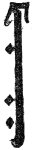
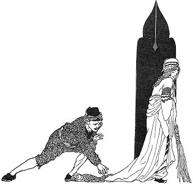
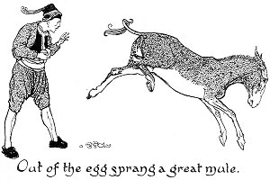
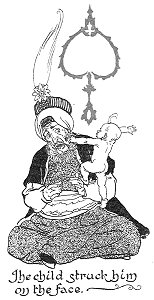

  
[Intangible Textual Heritage](../../index)  [Asia](../index) 
[Index](index)  [Previous](ftft10)  [Next](ftft12) 

------------------------------------------------------------------------

Forty-four Turkish Fairy Tales \[1913\], at Intangible Textual Heritage

------------------------------------------------------------------------

p. 64

 

|                     |
|---------------------|
|  |

HERE was once a fisherman of the name of Mahomet, who made a living by
catching fish and selling them. One day, being seriously ill and having
no hope of recovery, he requested that, after his death, his wife should
never reveal to their son that their livelihood had been derived from
the sale of fish.

|                    |
|--------------------|
|  |

The fisherman died; and time passed away until the son reached an age
when he should begin to think about an occupation. He tried many things,
but in none did he succeed. Soon afterwards his mother also died, and
the boy found himself alone in the world and destitute, without food or
money. One day he ascended to the lumber-room of the house, hoping to
find there something he might be able to sell.

During his search he discovered his father's old fishing-net. The sight
of it convinced the youth that his father had been a fisherman; so he
took the net

p. 65

and went to the sea. A modest success attended his efforts, for he
caught two fish, one of which he sold, purchasing bread and coal with
the money. The remaining fish he cooked over the coal he had bought, and
having eaten it, he resolved that he would follow the occupation of a
fisherman.

It happened one day that he caught a fish so fine that it grieved him
either to sell it or to eat it. So he took it home, dug a well, and put
the fish therein. He went supperless to bed, and being hungry he got up
early next morning to catch more fish.

When he came home in the evening we may imagine his astonishment at
finding that his house had been swept and put in order during his
absence. Thinking, however, that he owed it to his neighbours' kindness,
he prayed for them and called down Allah's blessing upon them.

Next morning he rose as usual, cheered himself with a sight of the fish
in the well, and went to his daily work. On returning in the evening he
found that again everything in the house had been made beautifully clean
and tidy. After amusing himself for some time by watching the fish, he
went to a coffeehouse where he tried to think who it could be that had
put his house in order. His reflective mood was noticed by one of his
companions, who asked what he was thinking about. When the youth had
told the story his companion inquired where the key was kept, and who
remained at home during the fisherman's absence. The youth informed him
that he carried the key with him, and that there was no living creature
about except the fish. The companion then advised him to remain at home
next day and watch in secret.

The youth accordingly went home, and next morning instead of going out,
merely made a pretence of doing so. He opened the door and closed it
again, then hid himself in the house. All at once he saw the fish jump
out of the well and shake itself, when behold! it became a beautiful
maiden. The youth quickly seized the fish's skin, which it had shed, and
cast it into the fire. "You should not have done that," said the

p. 66

maiden reprovingly, "but as it cannot now be helped, it does not
matter."

Being thus set free, the maiden consented to become the youth's wife,
and preparations were made for the wedding. All who saw the maiden were
bewildered by her beauty and said she was worthy to become the bride of
a Padishah. This news reaching the ears of the Padishah, he ordered her
to be brought before him. When he saw her he fell in love with her
instantly, and determined to marry her. 

|                                                                   |
|-------------------------------------------------------------------|
|  |

Therefore he sent for the youth, and said to him: "If in forty days you
can build me a palace of gold and diamonds in the middle of the sea, I
will not deprive you of the girl; but if you fail, I shall take her
away." The youth went home very sadly and wept. "Why do you weep?" asked
the maiden. He told her what the Padishah had commanded, but she said
cheerfully: "Do not weep; we shall manage it. Go to the spot where you
caught me as a fish and cast in a stone. An Arab will appear and utter
the words 'your command?' Tell him the lady sends her compliments and
requests a cushion. He will give you one take it, and cast it into the
sea where the Padishah wishes his palace built. Then return home."

The youth followed all these instructions, and next day, when they
looked toward the place where the cushion had been thrown into the sea,
they saw a palace even more beautiful than that the Padishah had
described. Rejoicing, they hastened to tell the monarch that his palace
was an accomplished fact.

Now the Padishah demanded a bridge of crystal. Again the youth went

p. 67

home and wept. When the maiden heard the cause of his new grief she
said: "Go to the Arab as before, and ask him for a bolster. When you get
it, cast it in the sea before the palace." The youth did as he was
counselled, and looking round, he saw a beautiful bridge of crystal. He
went directly to the Padishah and told him that the task was
fulfilled.

|                                                      |
|------------------------------------------------------|
|  |

As a third test, the Padishah now demanded that the youth should prepare
such a feast that every one in the land might eat thereof and yet
something should remain over. The young fisherman went home, and while
he was absorbed in thought the maiden inquired what was the matter. On
hearing of the new command she advised: "Go to the Arab and ask him for
the coffee-mill, but take care not to turn it on the way." The youth
obtained the coffee-mill from the Arab without any difficulty. In
bringing it home he began quite unconsciously to turn it, and seven or
eight plates of food fell out. Picking them up, he proceeded homewards.

p. 68

On the appointed day every one in the land, in accordance with the
Padishah's invitation, repaired to the fisherman's house to take part in
the feast. Each guest ate as much as he wanted, and yet in the end a
considerable portion of food remained over.

Still obdurate, the Padishah ordered the youth to produce a mule from an
egg. The youth described to the maiden his latest task, and she told him
to fetch three eggs from the Arab and bring them home without breaking
them. He ob tamed the eggs, but on his way back dropped one and broke
it. Out of the egg sprang a great mule, which after running to and fro
finally plunged into the sea and was seen no more.

The youth arrived home safely with the two remaining eggs. "Where is the
third?" asked the maiden. "It is broken," replied the youth.

|                                                    |
|----------------------------------------------------|
|  |

"You ought to have been more careful," said the maiden, "but as it is
done it can't be helped." The youth carried the eggs to the Padishah,
and asked permission to mount upon a bench. This being granted, he stood
on the bench and threw up the egg. Instantly a mule sprang forth and
fell upon the Padishah, who sought in vain to flee. The youth rescued
the monarch from his danger, and the mule then ran away and plunged into
the sea.

In despair at his inability to find an impossible task for the youth,
the Padishah now demanded an infant not more than a day old, who could
both speak and walk. Still undaunted,, the maiden counselled the youth

p. 69

to go to the Arab with her compliments, and inform him that she wished
to see his baby nephew. The youth accordingly summoned the Arab, and
delivered the message. The Arab answered: "He is but an hour old: his
mother may not wish to spare him. However, wait a bit, and I will do my
best."

To be brief, the Arab went away and soon reappeared with a newly born
infant. No sooner did it see the fisherman than it ran up to him and
exclaimed: "We are going to Auntie's, are we not?" The youth took the
child home, and immediately it saw the maiden, with the word "Auntie!"
it embraced her. On this the youth took the child to the Padishah.

When the child was brought into the presence of the monarch, it stepped
up to him, struck him on the face, and thus addressed him: "How is it
possible to build a palace of gold and diamonds in forty days? To rear a
crystal bridge also in the same time? For one man to feed all the people
in the land? For a mule to be produced from an egg?" At every sentence
the child struck him a fresh blow, until finally the Padishah cried to
the youth that he might keep the maiden himself if only he would deliver
him from the terrible infant. The youth then carried the child home. He
wedded the maiden, and the rejoicings lasted forty days and forty
nights.

Three apples fell from the sky: one belongs to me, another to Husni, the
third to the storyteller. Which belongs to me?

 

------------------------------------------------------------------------

[Next: The Horse-Dew and the Witch](ftft12)
