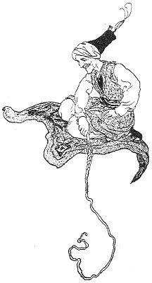
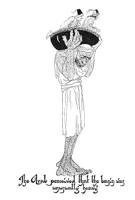
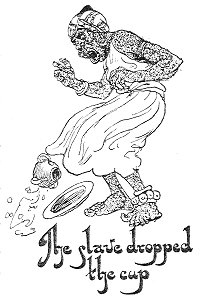
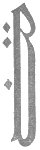
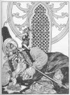

  
[Intangible Textual Heritage](../../index)  [Asia](../index) 
[Index](index)  [Previous](ftft13)  [Next](ftft15) 

------------------------------------------------------------------------

Forty-four Turkish Fairy Tales \[1913\], at Intangible Textual Heritage

------------------------------------------------------------------------

p. 87

 

|                     |
|---------------------|
|  |

HERE were once two brothers, whose parents were dead. With his share of
the inheritance the elder opened a shop, but the younger squandered his
portion in foolish pleasures. A day came when the latter had no more
money, so he went to his brother and begged a few paras. 

|                    |
|--------------------|
|  |

When he had spent those, he went again to his brother and obtained more
money. This practice he continued until eventually the elder realized
that in order to save the remnant of his fortune, he must sell his
business and emigrate to Egypt. The younger, however, got wind of his
brother's intention, and before the ship sailed, he stole on board with
out being observed and hid himself. The elder brother, fearing that if
he discovered his intention the younger would follow him, avoided
showing him, self on deck. Hardly had the ship set sail than both
appeared on the deck, and the elder saw that his plan had failed, and
that his younger brother would still be as a burden hanging round his
neck.

The elder brother was angry, but anger was of no avail; the ship bore
them both to

p. 88

\[paragraph continues\] Egypt. After they
had disembarked, the elder said to the younger: "Remain here while I
procure mules to carry us farther."

Accordingly the younger sat down on the shore to await the other's
return--but in vain. "I will seek him," he said to himself, and set out
after his brother.

He took short steps and long strides and travelled in this wise for six
months, when looking backward one day he saw that nevertheless he had
accomplished only a short distance. Then he took longer strides and went
for half a year forward, gathering violets, and in this way he came to
the foot of a mountain. Here, seeing three fellows quarrelling, he went
up and asked them the cause of their difference.

"We are the children of one father," said the eldest; "he died not long
ago and left behind him a turban, a whip, and a praying-carpet. Whoever
sets the turban on his head becomes invisible. Whoever sits on the
carpet and cracks the whip, flies away like a bird. Who shall have the
turban, who the whip, and who the carpet? This is the matter about which
we are continually wrangling."

"All three things should belong to one of us," they all cried.

"I am the eldest--they ought to belong to me." "No, to me, the second
son." "Oh no, to me, the youngest." With words and sticks they
belaboured each other so mercilessly that the prodigal had much
difficulty in separating them.

"Not so," said he, "I will make an arrow out of a piece of wood and
shoot it. You will all run after it, and whichever of you brings it back
to me becomes the possessor of the three things."

The arrow sped its way, and the three brothers ran after it. While this
was happening, however, our prodigal was thinking: "I have only to put
on the turban, sit on the carpet, crack the whip, and in a twinkling I
shall be where my brother is." To think was to act, and before he was
aware of moving he found himself at the entrance to a large city.

As soon as he had arrived in the town he was informed by one of the

p. 89

\[paragraph continues\] Padishah's
entourage that the Sultan's daughter disappeared every night. Whoever
could discover what became of her would be given the maiden in marriage
and half of the kingdom besides. "I will solve the mystery," said the
prodigal; "take me to the Padishah; if I fail, here is my head!" He was
accordingly taken to the palace, and at night posted at the door of the
Princess's sleeping-chamber, to await with one eye open whatever should
happen. The Princess waited until she thought he would be asleep and
then peeped cautiously round the door. He appeared to be in a sound
sleep, but, to make assurance doubly sure, she pricked the soles of his
feet with a pin, and as he did not stir, she took up the candle in her
hand and went out stealthily by a side-door.

 

Putting the turban on his head, the young man rose and followed her. As
he came outside he saw before him an Arab, on whose head rested a golden
basin, and in this bowl sat the Princess. The prodigal immediately
sprang into the basin, nearly upsetting it as he did so. The Arab,
astonished, asked the maiden what she was doing, for he had nearly
dropped her. "I have not moved a

p. 90

finger," answered the maiden; "I am sitting in the basin exactly as you
put me."

|                                                                         |
|-------------------------------------------------------------------------|
|  |

When the Arab took a few steps he perceived that the basin was unusually
heavy. (The young man was, of course, rendered invisible through wearing
the magic turban.) "What has happened to you, lady?" asked the Arab;
"today you are so heavy that you nearly crush me."

"Nothing, dear lala," replied the Princess. "I am neither heavier nor
lighter."

Shaking his head dubiously, the Arab set out and ere long they came to a
splendid garden, the trees of which were composed of silver set with
diamonds. The prodigal broke off a branch and put it in his pocket,
where, at the trees began to sigh: "A mortal has injured us! A mortal
has injured us!" The Arab and the Princess were bewildered and knew not
what to think.

However, they journeyed farther and ere long came to another garden, the
trees of which were of gold and precious

p. 91

stones. Here also the young man broke off a branch, whereupon all the
trees commenced to groan so loudly that the heavens were shaken. "A
mortal has injured us!" they complained. The Arab was dumb with
amazement.

|                                             |
|---------------------------------------------|
|  |

Now they reached a bridge, crossing which they arrived at a palace,
where a multitude of slaves awaited the Princess. Folding their arms
over their breasts, they bowed themselves to the earth. The Sultan's
daughter alighted from the basin, stepping on to the Arab's body and
thence to the earth. As slaves brought her a pair of slippers studded
with jewels, the prodigal seized one and put it in his pocket. The other
the Princess put on and then looked about for the missing one, but it
had entirely disappeared.

Angry, she entered the palace, and the young man followed her the turban
on his head and the whip and carpet in his hands. The maiden entered an
apartment in which she found the Dew whose lips swept heaven and earth.
He asked her where she had been so long. She told him about the young
man who had been set to watch her, but the Dew consoled her and assured
her that there was no need for her to be anxious.

They both sat down, and sherbet in diamond-studded cups was brought by a
slave. As the Sultan's daughter reached out her hand to take one, the
young man struck the slave's arm, whereon he dropped the cup, and it
fell broken to the floor. The young man picked up a fragment and put it
in his pocket.

"Did I not tell you," cried the Sultan's daughter, "that nothing goes

p. 92

right today? I will not take any sherbet; I will not take anything. I
will go home again." The Dew calmed her, and ordered other food to be
brought by a different slave. The table was laid, and many dishes were
set thereon; but while they ate, the young man, who was hungry, also
helped himself The Dew and his visitor nearly swooned with fright when
they realized that there was a third--and invisible--guest.

The Dew was now quite perturbed, especially as so much of the
confectionery and so many of the cups disappeared. He himself advised
the Sultan's daughter to return home earlier than usual that day, and he
was about to kiss the Princess in farewell, when the invisible youth
tore them apart.

|                     |
|---------------------|
|  |

OTH grew pale and summoned the lala. The maiden, sitting in the bowl,
ordered the slave to take her home. The prodigal quickly seized a sword
from the wall and severed the Dew's head from his body. As the head fell
to the ground, heaven and earth trembled, and groans and wailing arose.
"Woe to us! a mortal has killed our king!" Even the prodigal was
terrified, knowing not where he was. He quickly spread his carpet, sat
thereon, and cracked his whip. When the Sultan's daughter arrived back,
behold! the young man was already outside the door of her chamber,
apparently fast asleep and snoring loudly.

"Interfering pig!" grumbled the Princess in a fury, "thou hast caused me
enough unhappiness today." So saying, she again pricked the soles of his
feet with a pin, and as he gave no sign she concluded that he was still
asleep.

Next morning the prodigal was sent for, and asked whether he had solved
the mystery of the Princess's nocturnal disappearances. If he had not,
his head would be cut off. "Oh yes, I know all," he answered, "but I
shall not tell you; take me to the Padishah." Brought before the ruler,
he promised to tell him all if he would assemble together the
inhabitants of the city. "Thus I can easily find my brother," he thought
to himself. Accordingly all the inhabitants were collected in the
marketplace, where

p. 93

[  
Click to enlarge](img/09300.jpg)  
The prodigal severed the Dew's head from his body  

p. 94

the Padishah and his daughter sat on a dais. Near at hand stood the
prodigal, who related the account of his adventure from beginning to
end. "Do not believe it, father; it is not true!" frequently interrupted
the Princess.

Here the youth took from his pocket the jewelled branch, the golden
slipper, the costly plate; and just as he was describing the death of
the Dew-King he caught sight of his brother in the crowd. He said no
more and heard no more, but sprang down to join his brother, who at once
began to run. The prodigal ran after him, and at length caught him.

When they both returned the younger begged the Padishah to give the
Princess and half the kingdom to his brother. For himself, the magic
turban, the magic carpet, and the magic whip were enough; with those he
could always procure a livelihood. His only desire was always to be near
his brother.

The Sultan's daughter rejoiced when she heard of the death of the
Dew-King, who had cast a spell over her. Now that this spell was broken
she felt nothing but abhorrence for the monster, and in her joy at being
free she was quite willing to become the wife of the prodigal's brother.
Their wedding festivities lasted forty days and forty nights. I was
there also, and when I asked for pilaf the cook gave me such a blow on
my hand that it has been lame ever since.

 

------------------------------------------------------------------------

[Next: Mahomet, the Bald-head](ftft15)
