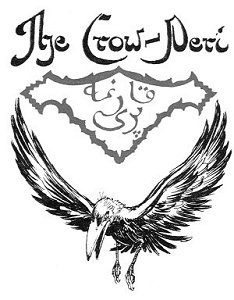
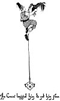
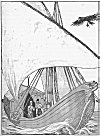
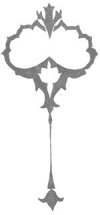

  
[Intangible Textual Heritage](../../index)  [Asia](../index) 
[Index](index)  [Previous](ftft17)  [Next](ftft19) 

------------------------------------------------------------------------

Forty-four Turkish Fairy Tales \[1913\], at Intangible Textual Heritage

------------------------------------------------------------------------

p. 126

 

|                     |
|---------------------|
|  |

HERE was once a man who had a son. The man spent the whole day in the
wood, catching birds which he sold. One day the father died and the boy
was left alone in the world. He did not know what his father's
occupation had been, until one day among some things his parent had left
he came across a bird trap. Taking it up he went to the forest and set
it in a tree. Soon a crow flew by, alighted on the tree and was caught.
The boy climbed up and was about to seize the bird, when it begged him
to set it free in exchange for a much more beautiful and more valuable
bird. It pleaded so earnestly that at length the boy liberated it.

He set the trap again and sat down at the foot of the tree to wait. Very
soon another bird flew to the tree and was caught in the trap. The boy
was astonished at its beauty; never in his life had he seen such a
lovely bird. Regarding it from all sides, he caressed it, and was about
to carry it home when the crow flew near him and said: "Take this bird
to the Padishah; he will buy it." So the boy put the bird in a cage and
transported it to the palace. On seeing the beautiful little creature
the Padishah was so pleased that he gave the boy more gold than he knew
what to do with. The bird was placed in a golden cage and the Padishah
amused himself with it day and night.

The Padishah had a lala who was envious of the boy's fortune and

p. 127

<table data-align="LEFT">
<colgroup>
<col style="width: 100%" />
</colgroup>
<tbody>
<tr class="odd">
<td data-valign="CENTER"><a href="img/12700.jpg"> 
Click to enlarge</a> 
 
</td>
</tr>
</tbody>
</table>

racked his brains to think of a plan for depriving him of it. One day he
went to the Padishah and said: "How beautiful this bird would look in an
ivory kiosk!" "But, lala," answered the Padishah, "where could I get
sufficient ivory?" "He who brought you the bird can also procure you the
ivory," said the crafty lala.

The Padishah sent for the bird catcher and commanded him to procure
enough ivory to build a kiosk for the bird. " But, Padishah," protested
the youth, "wherever can I get so much ivory?" "That is your affair,"
answered the King. "I will give you forty days in which to collect it:
if it is not here by that time, I will have your head off."

In deep trouble the youth left the monarch's presence. While he was
absorbed in thought the crow appeared and asked the cause of his grief.
The bird-catcher told the crow what misfortune the little bird had
caused him. "Sorrow not," returned the crow, "but go to the Padishah and
ask him for forty waggons of wine."

The youth went to the palace and obtained the wine. As he was coming
away with it the crow flew up and said: "Near the forest are forty
drinking-troughs. All the elephants come there to drink; go and pour the
wine into the troughs, and then when all the elephants are lying
stupefied on the ground, cut off their tusks and take them to the King."

p. 128

The youth acted according to the crow's instructions, and took the forty
waggons loaded with ivory back to the palace. The King was so delighted
with the quantity of tusks that he rewarded the bird-catcher lavishly.
The kiosk was soon built and the bird put in. The beautiful creature
hopped about joyously in its new home, but it did not sing. "If its
master were here," suggested the wily lala," it would have the desire to
sing." "Who knows who was its owner and where he can be found?" answered
the King sadly. "He who brought you the ivory can surely discover the
owner of the bird," said the lala.

So the Padishah called the youth and ordered him to find out the former
owner of the bird. "How should I know who was its owner?" said the
bird-catcher, "I caught it in the wood." "That is your affair," returned
the King. "If you do not find him, you shall be put to death. I will
give you forty days to seek him."

The youth went home and wept most bitterly; but the crow appeared and
inquired why he sorrowed. The poor youth told his story. "That trifle is
not worth so many tears," replied the crow. "Go immediately to the King
and request a large ship, large enough to accommodate forty maidens,
with a garden and also a very beautiful bath on board." The bird-catcher
went to the Padishah and told him what was required for the voyage. The
ship was built according to his wish. The youth went aboard, and while
he was considering whether he should sail to the right or to the left,
the crow once more appeared. "Sail always to the right," he instructed,
"and stop not until you come to a high mountain. At the foot of this
mountain dwell the forty peris. When they see your ship they will all
desire to inspect it. However you must let only the queen come on board,
for she is the owner of the little bird. While you are showing her the
ship, set sail and stop not again until you have arrived home."

So the youth sailed away in his ship, bore always to the right and
stayed not until he reached the mountain. There on the seashore the
forty peris

p. 129

[  
Click to enlarge](img/12900.jpg)  
The Queen is entrapped  

p. 130

were taking a walk, and as soon as they spied the ship they wished to
inspect it. The Queen begged the bird-catcher to let them see the
interior of the vessel, as they had never seen a ship before. The Queen
only, how ever, was permitted to come aboard, and a canoe was sent to
the shore to fetch her. The fairy was delighted with the beautiful ship.
She walked the deck, promenaded in the garden, and seeing the bath
exclaimed: "As I am here I will also bathe."

So she went into the bath, and while she was therein the ship set sail.
By the time the Peri had finished her bath the ship was already far out
at sea. Hurrying on deck she saw they were almost out of sight of land,
and she broke into loud cries of despair. What would happen to her?
Where were they taking her? The youth, endeavouring to console her, told
her that she was going to good people and to a royal palace.

Soon they reached the town whence the ship had set out, and the Padishah
was told of the vessel's safe arrival. The fairy was conducted to the
palace, and when she passed the bird's kiosk it began to sing so
ravishingly that every one hearing it was enraptured. The fairy was now
more at her ease, and she was completely reassured at meeting the
Padishah, who admired her so much that he was unable to take his eyes
off her. The marriage of the Padishah to the fairy took place soon
afterwards, and the King was now the happiest man in the world.

But the lala was bursting with rage.

One day the Queen was taken very ill. The medicine that would cure her
illness was at home in her fairy palace, and the lala promptly advised
that the bird-catcher should be sent to fetch it. Accordingly he
embarked, but when about to set sail the crow appeared and inquired
whither he was bound. The youth replied that the Queen was ill, and that
he was going to her fairy palace to fetch the medicine. "You will find
the palace on the other side of the mountain," said the crow. "Two lions
guard the door. Take this feather with you, and if you stroke their maws
with it, they will do you no harm."

p. 131

The youth accepted the feather and set sail. Casting anchor before the
mountain, he soon saw the palace. He went up to the entrance where stood
the two lions, and when he stroked their maws with the feather they
withdrew. The fairies, seeing the young man, suspected that their Queen
was ill, so they gave him the medicine and he returned home again
without delay. As he entered the Pen's apartment with the medicine, the
crow alighted on his shoulder and thus they both stood before the
patient. The Queen had already nearly expired, but the moment she took
the medicine she revived. Opening her eyes, and seeing the bird-catcher
with the crow upon his shoulder, she addressed the latter and said:

"You hateful bird, have you then no pity for this poor young man that
you have caused him so much suffering?"

Then the Queen told her husband that this crow had once been her
fairy-servant, whom she had changed into a crow as a punishment for her
negligence.

"But now," said she, addressing the bird, "I pardon you, seeing that you
still love me."

 

p. 132

On this the crow shook itself, and behold a lovely maiden stood before
the bird-catcher! in accordance with the Queen's wish the King gave the
crow-peri in marriage to the bird-catcher. The false lala was dismissed
from his post and the young bird-catcher was made Vezir. Thus they all
lived happily ever after.

 

------------------------------------------------------------------------

[Next: The Forty Princes and the Seven-headed Dragon](ftft19)
