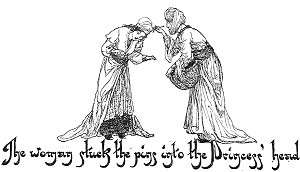
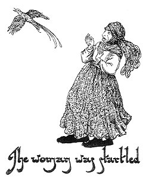
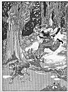

  
[Intangible Textual Heritage](../../index)  [Asia](../index) 
[Index](index)  [Previous](ftft22)  [Next](ftft24) 

------------------------------------------------------------------------

Forty-four Turkish Fairy Tales \[1913\], at Intangible Textual Heritage

------------------------------------------------------------------------

p. 174

 

|                     |
|---------------------|
|  |

HERE was once a Padishah whose daughter was so beautiful that her
loveliness was without equal in the world.

|                    |
|--------------------|
|  |

Now the Padishah's wife had an Arab slave whom she kept locked up in a
room, and to whom every day she put the following questions: "Is the
moon beautiful? Am I beautiful? Are you beautiful?" "Everything and
everybody is beautiful," was invariably the answer. After this
entertaining dialogue the Sultana would lock the door again and go away.

One day, as the Padishah's daughter, by name Nar-tanesi or little
Pomegranate, was making a tour of the serai, the Arab caught a glimpse
of her and immediately fell in love with her. Thus on the next day the
Arab modified his usual answer as follows: "The moon is beautiful, you
are beautiful, I am beautiful, but Nar-tanesi is the most beautiful of
all."

The Sultana was exceedingly angry. Now that the Arab had seen her
daughter, probably he would no longer admire the mother. So she went to
the Princess and proposed that they should take a walk together. During
the promenade they came to

p. 175

a meadow, where the maiden, being fatigued, lay down in the shade of a
tree. When she fell asleep the mother left her there and hastened back
to the palace.

When the Princess awoke and could not see her mother she began to weep,
running hither and thither in fear, seeking her mother everywhere. It
was of no avail, however, and soon her cries of despair echoed through
wood and field.

Three brothers were by chance hunting in the forest, and came upon the
distressed maiden. When she saw them she was still more afraid, and
implored their grace and protection, requesting them to accept her as a
sister. Overcome with pity the three hunters agreed to be her brothers,
and she accompanied them to their home.

Henceforth the three youths went hunting every day, and when they
brought home the game, the Princess prepared it for eating. Thus the
days passed merrily away.

But the news of the maiden's extraordinary loveliness spread far and
wide. The story was told of her discovery by the three brothers in the
forest, and how they had taken her home to be their sister. This came to
the ears of the Sultana, her mother, who was enraged to find her
daughter still living. She thought the girl had long ago been torn to
pieces and devoured by wild beasts.

She went accordingly to a witch and asked what she should do further to
get rid of her daughter. The witch gave the Sultana two magic hairpins,
saying that if she stuck them in the Princess's head the girl would
surely die. The woman took the hairpins, and disguised herself as a poor
beggar by means of an old feredje. Packing various articles in a bundle,
she went to the maiden.

Whenever the three brothers were away hunting, the Princess kept the
door locked; and when the woman knocked she made no answer. "Oh, my
child," cried the woman, " why do you not open the door? I have come all
the way from Anatolia with presents for my sons; at least

p. 176

receive them from me." Then the maiden answered through a crack in the
door: "The door is locked." "My daughter," returned the woman, "having
heard that you are their sister, I have brought you also a present of
some hair pins; hold your head close to the keyhole that I may stick
them in." Suspecting no evil the girl put her head to the key. hole. The
woman stuck the pins [into](errata.htm#3) the Princess's head, and she
fell down dead immediately. Having thus accomplished her revenge, the
Sultana went straight back to the serai.

|                                                                    |
|--------------------------------------------------------------------|
|  |

When towards evening the brothers returned from hunting and entered the
house, they saw the dead body of the maiden lying by the door. They
raised loud lamentation and wrung their hands in despair. When their
grief was somewhat calmed they began to prepare for the funeral. Laying
their sister in a golden casket, they took it up a hill and hung it
between two trees.

It came to pass soon after this that the son of a Padishah went hunting
and saw the golden casket hanging from the trees. Taking it down he
opened it, and when he saw the lovely maiden lying within he fell deeply
in

p. 177

love with her. The casket was carried to his home and put into his own
apartment, and whenever he went out he took care to lock the door. The
Prince spent his days in hunting, and the nights in looking at and
sighing over the dead maiden.

In the meantime the Padishah intended to take part in a war that had
broken out; but the Vezir dissuaded him, advising him to send his son
the Shahzada instead. Therefore the King called his son and ordered him
to go to the battlefield. The youth returned to his apartment, opened
the casket and took a last fond look at the serene countenance of the
maiden. He then locked up the room, and ordering that none should enter
it during his absence, he departed for the war.

We have omitted to state that the Shahzada was betrothed. The Princess
he was going to marry chanced to hear of the Shahzada's locked
apartment, and she determined to discover what secret he hid therein. It
availed nothing to tell her that the Prince had forbidden anyone to
enter it during his absence. She shook the door with such force that it
opened, and she entered the room. Seeing the dead girl in the casket,
she exclaimed in great irritation: "Who is this maiden that the Prince
guards day and night!" Looking at her more closely she saw the hairpins
sticking in her head. Putting forth her hand she drew them out; and
hardly had she done so than the maiden was transformed into a bird and
flew away.

A long time passed; the war was over, and the Shahzada came home again.
Hastening to his apartment, he found to his sorrow and dismay that the
casket was open and empty. In great wrath he asked his slave: "Who has
dared to enter my apartment?" "The Princess who is to be your bride,"
was the reply. "What can she have done to her!" groaned the Prince, and
from that time he became ill and grew worse every day.

Now that the war was ended the Padishah began to make preparations for
his son's marriage, and in due time the wedding took place.

p. 178

Every morning the bird came to the palace garden, and sitting on a tree
said to the gardener, "How is my Shahzada?" "He sleeps," was the answer.
"May he sleep and enjoy good health," said the bird, "and may the tree,
on which I sit, wither!" This dialogue continued daily for several days,
and every day a tree withered. The gardener called the attention of the
Shahzada to the matter, observing that if the thing went on much longer
there would not be a tree alive in the whole garden. The Prince's
curiosity being excited he set a trap to catch the bird. The bird being
duly caught, the Prince put it in a golden cage and took a delight in
regarding its wonderful plumage.

|                                          |
|------------------------------------------|
|  |

When first the Prince's wife saw the bird she recognised it as the
maiden of the casket, and made up her mind to destroy it as soon as
possible. Her opportunity came when one day the Shahzada had to go on a
journey. No sooner had he set off than she wrung the bird's neck and
threw it into the garden; and on his return home she told her husband
the cat had devoured it. The

Shahzada was very sorry for the accident, but it could not be helped.
When the dead bird was flung into the garden rose bushes sprang up
wherever its blood-drops fell. One day the gardener's wife came for some
flowers, and among those the gardener plucked was one of these roses.
They were put all together in a vase, but soon faded, with the exception
of the rose, which remained as fresh as when it was growing on its
stalk. "What wonderful flower is this?" exclaimed the woman.

p. 179

[  
Click to enlarge](img/17900.jpg)  
The Prince started in pursuit of it  

p. 180

"It does not fade!" And while she was sniffing its delightful odour it
suddenly changed into a bird, and flew hither and thither about the
room. The woman was startled, thinking it must be either an in or a jin.
However, after she had recovered herself somewhat, she took the
beautiful creature and caressed it, and in doing so she remarked on its
head something resembling a diamond. Examining it, she saw it was a pin.
She drew it out, and behold! the bird was transformed into a maiden, who
related to the astounded woman the story of her adventures.

Without delay the old woman went to the serai, stole into the private
apartment of the Shahzada and told him all. His joy was unutterable; he
bade the woman go home and take care of the maiden until he himself
should come in the evening.

Twilight was scarcely past when the Shahzada was on the spot. At sight
of the maiden he swooned away, and when he came to himself he requested
her to relate her story with her own lips. When he left the gardener's
house he took the maiden with him, but while on the road to the palace a
monkey sprang out upon them. The Prince started in pursuit of it, and he
was away so long that the maiden, being tired, fell fast asleep. Now it
had come to the knowledge of the maiden's mother that she had
disappeared from the casket, and in order to make certain that she would
not annoy her again, the Sultana left the serai in search of her,
meaning to kill her. After long wandering the woman chanced upon the
spot where her daughter lay sleeping. With suppressed glee she muttered:
"Oh! you have fallen into my hands once more!"

Meanwhile, failing to catch the monkey, the Prince hurried back to the
maiden, anxious lest any further harm should come to her. On arriving at
the spot he saw the maiden asleep and a woman by her side. When the
Prince demanded her intention, the woman said she was only keeping watch
over the girl, who might otherwise have suffered some ill.

Suddenly a thought struck the Shahzada, and he asked the woman who

p. 181

and what she was. She replied that she was a poor forsaken creature, who
had nothing, and who was alone in the world. Then said the Prince, "Come
with me, and I will repay your kindness." The maiden, however, being now
awake, recognised her mother, and secretly informed the Prince.

All three set off together towards the serai, the woman rejoicing over
the opportunity thus afforded her of putting her daughter out of the way
for ever. But as soon as they arrived at the palace the Prince ordered
the woman, as well as his wife, to be hanged, as a punishment for their
treacherous cruelty, and made preparations for his wedding with the
maiden of the golden casket. Thus they lived happily ever afterwards.

 

------------------------------------------------------------------------

[Next: Patience-Stone and Patience-Knife](ftft24)
