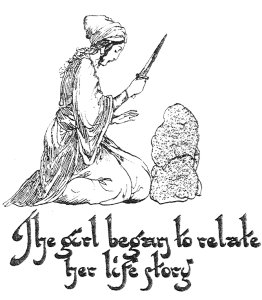
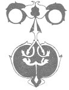

  
[Intangible Textual Heritage](../../index)  [Asia](../index) 
[Index](index)  [Previous](ftft23)  [Next](ftft25) 

------------------------------------------------------------------------

Forty-four Turkish Fairy Tales \[1913\], at Intangible Textual Heritage

------------------------------------------------------------------------

p. 182

 

|                     |
|---------------------|
|  |

HERE was once a poor woman who had a daughter. While the mother went out
washing, the daughter remained at home making embroidery. One day as the
maiden was at work by the window, a little bird flew in and said: "Oh my
poor maiden, your kismet is with a dead person," and immediately flew
off again. The girl's mind was now completely disturbed, and when her
mother came home in the evening she told her what the bird had said.
"Always be sure to fasten the door and window while you are at work,"
advised her mother.

|                    |
|--------------------|
|  |

Next day the girl secured the door and window, and commenced her work,
when suddenly, purr!--and the bird perched itself on her embroidery
table. "Oh my poor maiden, your kismet is with a dead person," it said
as before, and flew away. The girl was more frightened than ever and
told her mother when she came home. "Tomorrow," advised her mother,
"fasten door and window, creep into the cupboard, and work by
candlelight there."

p. 183

As soon as her mother had taken her departure next morning, the girl
fastened up the house, crept into the cupboard, lit a candle and began
her work. She had only made a few stitches when purr!--and the bird was
before her. "Oh my poor maiden, your kismet is with a dead person," it
repeated, and flew away. The poor girl had no mind to work that day, the
embroidery was cast aside, and she could do nothing but brood over what
the mysterious words might signify. Even the mother was perturbed when
in the evening she heard of the bird's third visit, and she resolved to
remain at home herself on the following day in order to see the
ill-omened creature. But the bird never came again.

Henceforth neither mother nor daughter quitted the house, but waited
constantly lest the bird should return. One day some girls belonging to
the neighbourhood came on a visit, and requested the woman to let her
daughter go out with them to enjoy herself and try to forget her sorrow.
The mother was afraid to let her daughter go, but as they promised not
to let her out of their sight for a moment, she eventually consented.

The party went into the meadows, and danced and made merry till sunset.
On their way home they stopped at a spring to quench their thirst. The
poor woman's daughter also went to the spring, and while she was
drinking, a wall rose up by magic and cut her off from her companions.
Such a wall had never been seen before; it was so high that none could
scale it, and so broad that none could cross it. All the girls were
terror-stricken; they moaned and wept and ran about in confusion
uttering cries of despair; what would become of the poor maiden and of
her poor mother!

"I told you," said one, "that we must not take her with us."

"What are we to say to her mother?" asked another. "How can we face
her?"

"It's your fault--you proposed it," said a third; and thus they disputed
while gazing helplessly at the gigantic wall.

The mother, standing at the door, was anxiously awaiting her daughter's

p. 184

return. The girls came weeping loudly, and could hardly find the courage
to tell the poor woman what had happened. When she under stood, however,
she ran to the wall, and there the air was filled with
lamentations--from the mother on the one side and the daughter on the
other.

Exhausted with weeping, the maiden fell asleep, and when she awoke next
day she espied a large door in the wall. Opening the door she saw a
splendid serai, more beautiful than she had ever dreamt of. She entered
the antechamber and saw forty keys hanging up on the wall. She took them
down, and opening each room in turn, she saw in one silver, in another
gold, in another diamonds, in a fourth emeralds, in each room a
different kind of precious stone till her eyes were aching with their
brilliance.

When she came to the fortieth room she saw there a handsome Bey on a
bier, a pearl fan beside him; on his breast was a document which read:
"Whoever for forty days will fan me and pray by me shall find her
kismet" The maiden now remembered what the little bird had said, that in
a dead person she should find her kismet.

She commenced to pray, and, with fan in hand, she sat down by the body.
Day and night she fanned and prayed until the fortieth day dawned. On
this last morning she glanced through the window and saw an Arab girl
before the palace. She called her in and instructed her to continue to
fan and pray while she, the white maiden, washed herself and put the
room in order.

Seeing the paper the Arab girl read it, and while the white maiden was
away the youth woke up. Looking about him he saw the Arab, embraced her,
and called her his promised wife. The poor maiden could scarcely believe
her own eyes when she returned to the apartment, and her astonishment
was complete when the Arab woman addressed her: "I, a Sultan's daughter,
am not ashamed to go in this dishabille, and yet this domestic dares to
appear before me in such finery!" She drove her

p. 185

forth from the room, and told her to go to the kitchen and mind her
work. The Bey could not help wondering what it meant, but he could say
nothing; the Arab was his wife and the other--the cook!

The feast of Bairam was approaching, and in accordance with custom the
Bey desired to make presents to all his servants. He inquired of the
Arab what present she would prefer. She requested a garment which
neither needle had sewn nor scissors cut. Then the Bey went to the
kitchen and asked the maiden what she would like.

|                                                |
|------------------------------------------------|
|  |

"A yellow patience-stone and a brown patience-knife--please bring me
both," said she.

The Bey departed and bought the garment, but the patience-stone and
patience-knife he could find nowhere. He would not return without them
if he could avoid it, so he entered a ship.

When the ship had accomplished half its voyage it came suddenly to a
full stop, and would go neither forward nor backward. The captain was
alarmed, and calling the passengers together he informed them that there
must be a man on board who had failed to keep his word; that was why
they could not proceed. Then the Bey stepped forth and confessed that he
was the man. He was accordingly put ashore, that he might fulfil his
promise and then return to the vessel. The Bey went from one place to
another till at length he stopped at a large spring. Hardly had he
leaned against the stone when a thick-lipped Arab appeared and asked
what he wanted. "A yellow patience-stone and a brown patience-knife," he
replied. The next moment the two articles were placed in the Bey's hand,
and he went joyfully back to the vessel, and in due course returned home
in time for

p. 186

the Bairam festivities. He gave his wife the garment, and took the
patience, stone and patience-knife into the kitchen.

The Bey became curious to know what the maiden would do with the things,
so one night he stole into the kitchen and hid himself to await
developments. Presently the maiden took the knife in her hand, set the
stone before her, and began to relate her life, story. She repeated what
the little bird had told her and described the terrible anxiety she and
her mother had endured. As she proceeded the stone began to swell up, to
gasp and splutter, as though it were an animate being. The maiden
further related how she came to the palace of the Bey, how she had
prayed by him and fanned him for forty days, and how finally she had
asked the Arab woman to relieve her for a few minutes while she went to
wash herself and put things in order. The stone swelled up still more,
and gasped and foamed as though it were about to burst.

|                                                           |
|-----------------------------------------------------------|
|  |

Proceeding, the maiden related how the Arab woman had deceived her, and
how the Bey had taken the Arab woman and not her, self to be his wife.
As though the stone had a heart, it gasped and swelled, and when the
maiden had finished her narrative it could endure no more, but split
asunder.

Now the maiden took up the knife and cried: "O yellow patience stone,

p. 187

though you are stone you cannot bear it; must then I, a weak maiden,
bear it?" She would now have plunged the knife into her own body had not
the Bey sprung from his hiding-place and stayed her hand. "You are my
true kismet!" exclaimed the youth, and he took her to the place of the
Arab woman. The false one was put to death, and the maiden's mother was
sent for to the palace, where they all lived happily ever after.
Sometimes a little bird flies in at the palace window and joyously
sings: "O maid! O happy maid! you have found your kismet."

 

------------------------------------------------------------------------

[Next: The Dragon-Prince and the Step-Mother](ftft25)
