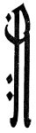
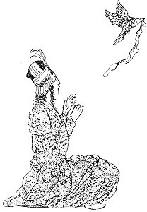
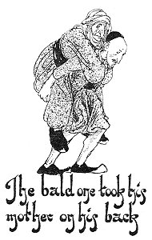
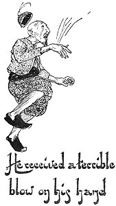

  
[Intangible Textual Heritage](../../index)  [Asia](../index) 
[Index](index)  [Previous](ftft31)  [Next](ftft33) 

------------------------------------------------------------------------

Forty-four Turkish Fairy Tales \[1913\], at Intangible Textual Heritage

------------------------------------------------------------------------

p. 243

 

|                     |
|---------------------|
|  |

VERY long time ago, when the fairies lived, while I was lounging about
in forbidden gardens, I came across one in which I fared very badly. I
painted my horse and thought its colour then looked quite natural;
bought a donkey and thought it was my wife; when one day the donkey
caught me a vicious kick, I thought my wife was caressing me. I went on
and on, sleeping in ancient ruins inhabited by owls, until I fared very
badly again. The great ball of Tophanes I put in my pocket for fruit;
the great minaret of Galata

|                    |
|--------------------|
|  |

I stuck in my mouth for a trumpet; the fortress of Kyz Kulesi I hugged
for a bear; I stuck myself in the midst of the sea for a rock: in short,
I was the biggest fool among all the fools. My sin was the relation of
these tales.

There was once a Padishah who had a daughter. Beautiful was she as the
full moon, slender as a cypress; her eyes gleamed like live coals, her
hair was as black as night, her eyebrows like bows and her eyelids like
arrows.

There was a large garden in the palace, in the midst of which was a
broad lake.

p. 244

By its side the Princess sat every day sewing and embroidering. Once, as
the Princess's ring was lying on the table near her, a little dove flew
down, took the ring in its beak, and flew off. The bird was so lovely
that the Princess fell quite in love with it. Next day the maiden laid
her bracelet on the table, and the bird carried that off likewise. The
flame of her love had now reached such a pitch of intensity that she
could neither eat nor drink, and scarce could wait until the following
day. On the third day she took the lace from the table and put it close
beside her. The bird came as before and flew off with the lace. The
maiden had now hardly strength enough to rise; she went in tears back to
the palace and there broke down altogether. One of the court dames,
perceiving her distress, asked: "O lady, why do you weep? Who has
injured you?" "I am weary and sad at heart," answered the Sultan's
daughter, weeping and sighing continually.

The Princess was the Padishah's only child, and the court dame feared to
inform him of her illness. But seeing the maiden become paler day by day
she overcame her fear and reported the Princess's condition to her
father. The alarmed Padishah visited the maiden with a large train of
physicians and hodjas, but no one could explain her malady. Next day the
Vezir said to the King: "Physicians and hodjas are of no avail for your
daughter; we must seek a remedy elsewhere." He advised the Padishah to
have a large bath built, whose waters should cure all complaints; and
every one who came to use the bath should be obliged to relate his
life-story. This was done, and a royal proclamation issued that by the
use of that bath the bald should receive hair, the deaf should hear, the
blind see, and the lame walk. The populace came in streams; each person
had a free bath which cured his disease, and was allowed to go after
relating his life-story.

One bald man had a lame mother; they also heard of the healing property
of the bath. "Let us go," said the son; "peradventure we may be cured."
"How can I go," mumbled the old woman, "when I

p. 245

cannot stand on my feet?" "That's easily managed," answered the bald
one, taking his mother up on his back and setting out for the bath. As
they went along the man grew tired, and reaching a field near a river,
he put his mother down on the ground while he rested a little. A cock
passed by with a jug of water on its back. Curious to know where it was
going, the man followed it, until, coming to a great castle, the cock
entered through a hole in the wall. The young man crept in after it, and
found himself before a stately palace. Not a soul challenged him, and so
he walked in. 

|                                                            |
|------------------------------------------------------------|
|  |

Ascending the grand staircase, he entered the antechamber, and thence
wandered from one richly decorated apartment to another until he was
quite tired with walking. "Perhaps I shall see something alive shortly,"
he said to himself, and secreted himself in a chest, whence through a
hole he could see all that went on outside. Presently he saw three doves
fly in at the window; they shook themselves, and behold! they were trans
formed into beautiful maidens, more lovely than any he had seen in his
life before.

"We have been long away," observed one. "The Padishah will be here soon
and nothing is ready." One took a broom and swept out the chamber, the
other set the table, while the third brought in the dishes. Now they
shook themselves once more and, as doves, flew out at the window.
Meanwhile the bald one, feeling hungry, thought that, as there was no

p. 246

|                                                           |
|-----------------------------------------------------------|
|  |

one about, he might come forth from his hiding-place and help himself to
food. As he stretched forth his hand to grasp the viands he received
such a terrible blow on that member that it swelled up. He stretched out
his other hand, with the same result. The bald man was terrified, and
hastened back to his chest, and hardly had the lid closed upon him than
a white dove flew into the room, shook its plumage, and appeared as a
handsome youth.

Going to a small box he took therefrom a ring, a bracelet, and a lace
table cover. "O ring," he soliloquized, "how happy you are, for her
finger has worn you! O bracelet, how happy are you, for her arm has worn
you!" As he wept, he wiped the tears from his eyes with the lace.
Returning all the articles to the box, he ate the food prepared for him
and then lay down. The hungry bald man hardly managed to live till next
day, when the handsome youth arose, shook himself, and, as a bird, flew
out at the window. The man now stole out of the chest, entered the
courtyard, and through the hole in the wall escaped to freedom. There he
rejoined his poor mother, who was weeping and moaning because she
thought she had been forsaken by her son. He soon consoled her, and
taking her on his back they wended their way to the bath. They bathed,
and the old woman came forth without lameness and the bald man with
hair. Then they related their story, and when the Sultan's daughter
heard it she promised to give the man a rich reward if he would take her
to the castle he described.

p. 247

Next day, therefore, the Princess set off, with the formerly bald man
for her guide, and in due time they arrived at their destination. He
showed her the castle walls, assisted her through the hole, led her to
the doves' room, and pointed out the chest wherein she might conceal
herself. His duty done, the man went back, and with wealth and health he
and his mother lived comfortably all their days.

Toward evening the three doves flew into the room. Transformed into
maidens, they swept, put everything in order, set food on the table, and
went off again. Soon in flew the white dove, and the Princess in the
chest nearly swooned in ecstasy when she saw him transformed into a
handsome youth. He went to the little box, drew forth the ring, the
bracelet, and the lace which formerly had been in her possession. "O
ring," he sighed, "how happy you are, for you have been worn on her dear
finger! O bracelet, how happy you should be, for her arm has worn you!"
His eyes were wet with tears, which he dried with the lace. The maiden's
heart nearly burst with grief. She could not forbear knocking on the
inside of the chest with her finger. The youth heard the sound, opened
the chest, and behold! there stood before him his heart's love. They
embraced each other, and for some minutes were unable to speak for very
joy at this unexpected meeting.

Presently the youth inquired how she came there in the palace of the
Peris, and she told him all. Then the youth told her that he was born of
a mortal mother, but when he was only three days old the peris had
stolen him, and now he had become their padishah. He was compelled to be
with them the whole day except during two hours, when he was free. The
maiden might stay there that day, and during the daytime she could go
out and come in at pleasure; toward evening, however, she must hide, as
then the thirty peris came home, and if they saw her they would put her
to death. On the morrow he would show her his mother's konak, where she
could dwell in peace and where he would daily pass his two free hours
with her.

p. 248

Next day the Peri-Padishah pointed out to the Princess his mother's
konak. "Go," he said, "and greet her in the name of Bachtijar Bey, and
she will take you in and be kind to you."

When the maiden knocked, there came to the door an old lady who, when
she heard the name of her son, received her visitor most cordially. The
Princess dwelt there a long time, and was visited every day by the
little bird. In time it came to pass that a little son was born to the
Princess, but the old lady did not know about the baby Prince, nor that
her son visited the house.

Next day the little bird came as usual, flew in at the window and
chirped: "How is my little boy?" "Nothing is the matter with him,"
answered the Princess, "but he awaits Bachtijar Bey." "If only my mother
knew," sighed the youth, "she would furnish her best chamber for you."
Then changing himself into a man, he caressed his wife and fondled the
baby. When the two hours were expired he shook himself, was transformed
into a bird, and flew away.

Meantime the mother had heard her son's voice and was beside herself
with joy. She ran in to her daughter-in-law, kissed her again and again,
then left and prepared her best room for the Princess. When all had been
comfortably arranged the old lady inquired after her son. By this time
she was aware that he had been stolen by the peris, and now she meant to
devise some way to steal him back again. "When my son comes tomorrow,"
said she, "contrive to detain him later than usual; the rest is my
affair."

Next day the bird flew to the window, and not seeing the Princess there,
he flew to the best room and chirped: "How is my little boy?" The
Princess answered: "Much is the matter with him, he awaits Bachtijar."
The bird now changed himself into a man, and the happy husband and wife
entertained each other so pleasantly that the flight of time was
unnoticed.

What was the old lady doing meanwhile?

p. 249

In front of the house grew a large cypress-tree, on whose branches the
thirty peri-doves sometimes alighted. The old lady stuck poisoned pins
all over the tree. Towards evening the peris came in search of their
missing Padishah and sat on the tree: no sooner did they touch the
poisoned pins than they fell dead.

When the youth saw that it was late he was terror-stricken. He ran to
and fro, but chancing to look outside, he saw that the thirty peris were
not on the tree. His joy was now as great as his anguish had been a
moment before, and when his mother explained what had happened his
delight knew no bounds. Mother and son, husband and wife, were restored
one to another, and now with none to molest them they celebrated their
union for forty days and forty nights.

 

------------------------------------------------------------------------

[Next: The Deceiver and the Thief](ftft33)
