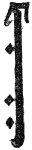
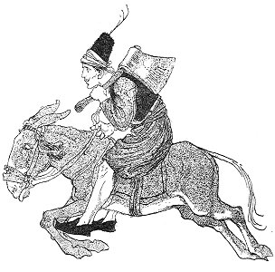
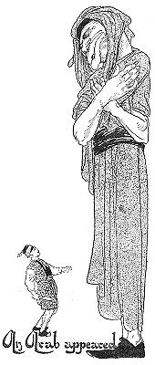
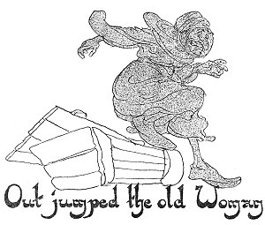
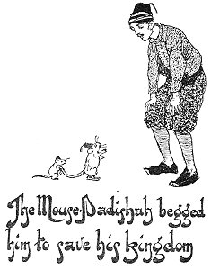

  
[Intangible Textual Heritage](../../index)  [Asia](../index) 
[Index](index)  [Previous](ftft33)  [Next](ftft35) 

------------------------------------------------------------------------

Forty-four Turkish Fairy Tales \[1913\], at Intangible Textual Heritage

------------------------------------------------------------------------

p. 257

 

|                     |
|---------------------|
|  |

HERE was once a poor woodcutter who said to his son: "When I am dead you
must continue my work. Go daily to the forest. Every tree you may fell,
except that on the edge of the forest, that you must spare." Some days
afterwards he died, and was buried.

The young man took up his father's work and felled trees for his
livelihood. Being one day in the neighbourhood of the forbidden tree, he
found himself wondering what could be the reason for it being spared
while all 

|                    |
|--------------------|
|  |

the rest were to come down. Presently, scarcely knowing why, he took his
hatchet and began to cut down the tree. But behold! as though the tree
had feet it began to retreat from him, and his blows cut only the air.
The wood-cutter bestrode his ass and trotted after the tree, but night
fell and he had not caught it. Tying up his animal to another tree, he
climbed into its leafy branches and settled himself to wait till
morning.

Next day he descended to find that nothing

p. 258

was left of his ass but its bones. "No matter, I must go on foot," said
the woodcutter, and ran after the tree. He followed it all day, but
could not overtake it. On the third day he was preparing to follow it
again, when suddenly he came upon a snake and an elephant fighting. He
stood and watched the combat until it ended in the snake swallowing the
elephant. The snake got it down, but the tusks stuck in its throat. Both
beast and reptile saw the young man, and both appealed to him for
assistance. The elephant promised him everything possible if only he
would kill the snake. On the other hand, the snake said: "Break off his
tusks; that task is easier and the reward will be greater." Thinking
that was the most sensible thing to do, the youth struck off the tusks
with his hatchet. The snake was extremely

 

p. 259

grateful for the service rendered, and told the young man to come with
him and receive the promised reward.

Stopping at a spring on the way, the snake said to his companion:
"Remain here while I take a bath; and whatever happens, fear not."

Hardly had the snake glided into the water when a fearful hurricane
arose; lightning flashed and thunder rolled, as though the end of the
world had come. Soon, however, all became calm again; the snake emerged
from the water in the form of a man, and they pursued their journey.

They travelled merrily along, drinking coffee, smoking their chibouques,
and sowing violets, until, when they were nearly at home, the Snake-peri
said to the young man: "Soon we shall arrive at the house of my mother.
When she opens the door I shall address you as 'Brother,' and call you
into the house. You will be offered coffee, but accept it not; food will
be set before you, but do not touch it. By the gate you will find a
small piece of mirror; request my mother to give it to you."

They reached the house, and as the peri knocked at the door, his mother
herself opened it. "Come in, brother," he said to the young man. "Who is
your brother?" inquired his mother. "One who has saved my life," replied
the peri, and told his mother what had happened. They entered the house,
and the woman offered coffee and a chibouque to the young man, but he
did not accept them. "I am in a hurry," said he in excuse; "I cannot
remain here." "At least rest awhile," suggested the woman; "we cannot
allow a guest to go without taking something." "I need nothing,"
answered he. "But by the gate is a small piece of mirror; if you will
offer me that, I will accept it." The woman was not disposed to give it,
but her son was angry that she should refuse such a trifling thing to
the preserver of his life; therefore she gave it--but unwillingly.

p. 260

|                                    |
|------------------------------------|
|  |

The young man departed with the piece of mirror, and on the road he
looked at it, turning it over on all sides, wondering of what use it
could be to him. While he was thus fingering it an Arab appeared, one of
whose lips touched the sky and the other swept the ground. The young man
would have died of fright if the apparition had not reassured him, and
asked: "your command, my Sultan?" It was all he could do to find courage
enough to ask for something to eat. In a trice the most delicious food
was set before him, such as he had never seen before. This done, the
Arab disappeared.

The youth's curiosity was now aroused about the piece of mirror; he took
it out again and looked at it. Immediately the Arab was before him,
saying: "your command, my Sultan!"

In his confusion the young man stammered out something about a palace,
and behold! there rose up before him an edifice much more magnificent
than the Padishah inhabited. "Take it away," said the youth, and the
palace instantly disappeared. He was now very proud of his wonderful
possession,

p. 261

and thought of nothing but what he should wish for next. He remembered
that the Padishah had a lovely daughter, and at once he looked in the
mirror. "Your command, my Sultan!" exclaimed the thick-lipped Arab; and
the youth ordered a magnificent palace with the Padishah's daughter her
self in it. Hardly had he uttered the wish, when he found himself in the
palace and the Princess sitting by his side. They embraced, and kissed
each other, and were as happy as the days were long.

|                                            |
|--------------------------------------------|
|  |

In the meantime the Padishah was informed of the mysterious
disappearance of his daughter. He commanded search to be made for her
throughout the land, but all in vain; it was impossible to find her.
Then came an old woman who advised the Padishah to have a box made,
lined with tin. Into this he must put the old woman and cast her into
the sea. She promised to find the Princess, either on this side of the
ocean or on the other.

The box was accordingly made, and well supplied with food, then the old
woman was enclosed and thrown into the sea. Borne on the crest of the
billows, the box at length was cast up on the shore of the city where
was the palace of the young man and the Sultan' s daughter. Some
fishermen who

p. 262

were standing on the beach saw the box, and throwing out hooks and
ropes, they dragged it ashore. As soon as they opened it, out jumped the
old woman, and in answer to the inquiry whence she came, she said: "May
my enemy be struck blind!--I have not deserved such treatment." As she
wept, every one believed that she was a cruelly used old woman. "Where
is the Bey of this city?" she asked; "perchance he will pity me and give
me shelter in his house." The onlookers showed her the way to the palace
and encouraged her to believe that there she would meet with aid.

Arrived at the palace she knocked at the door, and the Princess called
from above asking what she wanted. The old woman recognised the voice,
but as though she were a stranger she begged to be taken in as a
domestic servant. "My husband will be home this evening," answered the
Princess; "till then remain in the corner." When the master came he gave
orders that the old woman should be taken into his service.

Though the old woman had been several weeks in the palace she had never
once seen a cook or a servant of any sort, yet the richest and costliest
foods were served up and the most scrupulous cleanliness prevailed
everywhere. One day she ventured to ask the Princess whether she did not
feel lonely, and suggested: "With your permission, I would spend some of
the time in your company; that were surely better." "I will speak with
my husband on the matter," answered the Princess. The youth offering no
objection, the old woman now daily spent a considerable time in the
Princess's private apartment. One day the former made bold to ask whence
came the food and where were the servants. As the Princess was unaware
of the existence of the mirror she could not say. "Ask your husband,"
suggested the old woman, and when he came home the Princess was so
amiable with him that he showed her his treasure.

p. 263

This was not sufficient, however, for two or three days later the old
woman advised her mistress to ask her husband to give her the mirror, to
amuse herself with during his absence. He could refuse her nothing, and
so he gave it to her.

|                     |
|---------------------|
|  |

OW was the old woman's opportunity. Discovering the place where the
Princess kept the mirror, she stole it, and looked in it. When the
thick-lipped Arab appeared and asked, "What is your command?" she
ordered: "Take me and the Princess to her father." She further commanded
him to burn down the palace, and when the woodcutter's son came in the
evening he found nothing but his cat warming itself at the smoking ashes
of his beautiful home. He happened to find the remains of some food
which the Princess had thrown away, and putting this into his knapsack
he set forth to seek his wife, even though he should have to go to the
world's end to find her.

He wandered so long and so far that at length he reached the town where
dwelt the Padishah, his father-in-law. He went to the palace kitchen and
begged the cook to employ him; this was done out of pity for his
destitute condition. After a few days he learnt from his fellow-servants
that the Sultan's daughter had returned home after a mysterious absence.

One day the cook was taken ill, and the young woodcutter offered to take
his place. The cook gratefully accepted the offer and explained his
duties. Everything was done satisfactorily, only, when sending in the
dishes, the temporary cook laid the broken food he had picked up at his
ruined home on the Princess's plate. When she saw it she realised that
her husband was somewhere close at hand. She sent for the cook and asked
who was with him in the kitchen. At first he denied but finally admitted
that a young man was assisting him. The Princess now hastened to her
father and told him that in the kitchen was a young servant who made
such delicious coffee that she desired to have him for her own
coffeemaker. Henceforth he made the coffee and took it up

p. 264

|                                                                     |
|---------------------------------------------------------------------|
|  |

personally to the Princess. Thus they came together again, and the
Princess told her husband who was the cause of their misfortunes. They
deliberated constantly on the best means to recover the mirror.

The young man visited the Princess so often and remained with her so
long at a time that the old woman's suspicions were aroused. To be
brief, she looked into the mirror and had him carried off to the ashes
of his former palace. He found his cat still there, she having kept
herself alive by catching and eating mice.

She had devoured such an army of mice, however, that the Mouse. Padishah
had not enough soldiers left to defend his realm. The King of the Mice
was much concerned about it, but none of them dared approach the cat on
the subject.

One day he saw the young man and begged his aid to save his kingdom from
ruin. "I would gladly help you," returned the youth, "but I myself am
bowed down with grief." "What troubles you?" asked the Mouse-Padishah.
The woodcutter's son now told him the story of the mirror that had been
stolen from him by the old woman. "That matter can be rectified without
difficulty," the Mouse-Padishah assured him, Calling all his mice
together, he asked which of them inhabited the palace and whether they
knew where the mirror was hidden. An old lame mouse limped up, bowed
low, and kissing the earth before the Padishah, said he had seen the
mirror, which the old woman placed under the pillow every night.

The Padishah ordered him to obtain possession of it without delay.

[  
Click to enlarge](img/26401.jpg)

p. 265

Two of his companions offered to accompany him, and as he was so old and
infirm they carried him on their backs to the palace. It was night when
they arrived, and the old woman had just eaten a good supper. "We are in
nice time for a feed," said the lame mouse, as they entered the room.
They ate their fill, and awaited an opportunity to accomplish their
object. When the old woman had gone to bed they waited patiently until
she was fast asleep. Then the lame mouse climbed upon the bed and
tickled the old woman's nose with his tail until she sneezed so
violently that her head nearly fell from her body. While this was
happening the other mice dislodged the mirror from under the pillow;
after which they took the lame mouse on their backs again and scurried
away.

The youth, delighted to have recovered his cherished mirror, took up his
cat, that she might not harm his friends the mice, and withdrew.

Now he took out the mirror and glanced at it. Instantly the Arab stood
before him. "Your command, my Sultan?" he asked. The youth requested a
suit of cloth-of-gold and a mighty army. Turning round next moment he
saw the raiment ready to hand, and he put it on. A prancing steed stood
before him, and when he had mounted it an immense army followed him.
Thus he entered his native town in triumph. He drew up before the palace
gates and his soldiers formed a cordon round the building. When the
Padishah saw the invading host he trembled for his life and throne.

The youth approached the monarch and assured him that there was no cause
for fear if he would give him his daughter in marriage. Overwhelmed with
joyful surprise the Padishah was willing to give the young man, not only
his daughter, but even his kingdom as well. The old woman was dragged
off by the thick-lipped Arab; and the lovers lived happily ever
after--never parting with the piece of mirror, which proved to be their
help in every need.

------------------------------------------------------------------------

[Next: Little Hyacinth's Kiosk](ftft35)
