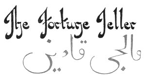
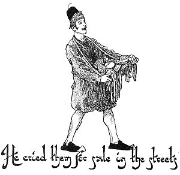
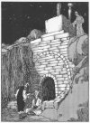
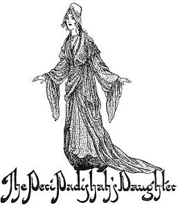

  
[Intangible Textual Heritage](../../index)  [Asia](../index) 
[Index](index)  [Previous](ftft37)  [Next](ftft39) 

------------------------------------------------------------------------

Forty-four Turkish Fairy Tales \[1913\], at Intangible Textual Heritage

------------------------------------------------------------------------

p. 290

 

|                     |
|---------------------|
|  |

HERE was once a widow who had three daughters. One spun cotton, the
others sewed, and thus they earned their daily bread.

|                    |
|--------------------|
|  |

Once these girls saw a gipsy passing along the street, and said to each
other: "Let us have our fortunes told." All agreeing, they called the
old woman, who, having had her hand crossed with silver, said to the
eldest of the sisters: "Thy kismet is at the bottom of a well." To the
middle sister she said: "Thy kismet is in the cemetery"; and to the
youngest she said: "Thy kismet is in shame." Having uttered these
ominous words, the gipsy disappeared.

One day while the eldest girl was spinning, her thread broke, the
spindle flew up ward, then fell and rolled over and over until it
suddenly disappeared down the well. "Oh dear!" she exclaimed, "my
spindle is in the well; help me to recover it." Her sisters bound a rope
round her body and let her down the well.

Now when the girl reached the bottom she saw an iron gate. She opened
it, and entering saw a youth and a maiden lying asleep, a baby in a
cradle by their side. She took off her shawl and covered the youth and
the maiden with it;

p. 291

and her eyes lighting on a knife, she picked it up and stuck it in her
girdle. This accomplished, she re. turned to the mouth of the well and
gave the signal to her sisters to pull her to the surface. Arrived at
the top, she was asked why she had been so long down the well. "I sought
my spindle until I found it," was the answer, and with that they had to
be content.

|                                                         |
|---------------------------------------------------------|
|  |

The youth was the son of a rich man, the maiden was a peri, and as she
had fallen in love with him, they met every day at the bottom of the
well. When she woke up and saw the shawl around her she was greatly
distressed. "Oh dear!" she cried, "a mortal has discovered us," and
instantly she disappeared, taking the baby with her. When the youth
missed his knife and failed to find it he observed: "Now I am delivered
from the peri I will discover, if possible, who has taken my knife." He
climbed out of the well, purchased a collection of odds and ends, and
cried them for sale in the streets. Whoever wished to buy from him was
informed that he was not selling for money, but that he would gladly
trade with anyone who had a knife of any kind.

Going up and down the streets, he came at length to the house wherein
dwelt the three sisters. They called him in and chose distaffs, needles,
and

p. 292

silks; and when they asked the price the merchant told them he could not
accept money for the articles, but would take an old knife. Upon this
the eldest sister produced the knife she had brought up out of the well.

This he accepted in exchange for the goods, then went home and told his
mother she must go to the maiden who had delivered him from the peri and
ask her in marriage for him. The lady went on her son's behalf; the
maiden consented to become his wife, and in due time the wedding took
place.

|                     |
|---------------------|
|  |

EAVING this happy couple, let us follow the fortunes of the remaining
sisters. One day they went together to the bath. They washed, and were
on their homeward journey, when suddenly the middle sister discovered
that the youngest was no longer by her side--she had disappeared
entirely. The disquieted sister searched the district for the lost one,
but she had gone without leaving the slightest trace behind. Being
completely exhausted with her efforts, the middle sister sat down to
rest in a cemetery, and there, overcome by fatigue, she fell asleep.
Suddenly she was awakened from sleep by the neighing of a horse, and
looking round she saw a man alight from a steed. He went to a certain
tomb, which he opened, brought forth a youth, gave him something to
smell, and thus restored him to consciousness. He then gave him food and
drink and demanded to know whether the youth would obey him. "I would
rather die," answered the youth, whereon the man shut him up again in
the tomb and went away.

The youth was a shahzada who had once been very ill, and the man was a
physician on whom the sick Prince's beauty had made such an impression
that he could not endure the thought of being parted from him. "I will
cure you," said the physician one day, "but only if you promise to obey
me ever after." The Prince would not agree, and the physician in revenge
administered to the Prince a stupefying draught, on which he fell into a
deathlike trance. His parents, believing him dead,

p. 293

[  
Click to enlarge](img/29300.jpg)  
''I would rather die,'' answered the youth  

p. 294

buried him in the vault, and there every night went the physician to
torment the poor youth until he should yield to his wishes.

Having witnessed this dramatic scene, the maiden waited till day dawned,
then went home, purchasing a plateful of lokma on the way, as she was
very hungry, While eating it she observed that all the people in the
shop were weeping, and she inquired the cause. "The Shahzada died forty
days ago," they said, "and his lokma remains on our hands." On this she
requested to be taken before the Sultana, for whom she had an important
message.

She was accordingly conducted to the palace, and when the Sultana
appeared the maiden informed her that her son was not dead as she
supposed, but alive. "Give him to me for my husband and I will restore
him to you," said the maiden to the Sultana.

"My dear, you are surely mad," answered the Sultana. "He died forty days
ago; today his bones must be all that is left of him." The maiden,
however, swore that the Shahzada was still alive. "If you do not
believe, come with me this night and I will show you

 

p. 295

your son." The Sultana consulted the Padishah on the matter, and at
night they went to the cemetery. Here they concealed themselves and
watched. At midnight the physician appeared, opened the tomb, and having
restored the Shahzada to consciousness, put his question, and received
the same answer as before. Hearing their son's voice the royal parents
hastened to the tomb and, weeping, pressed him to their hearts. Later
the wicked physician had his head struck off, and the maiden who had
been the means of restoring the Prince was united with him in marriage.

|                                                                      |
|----------------------------------------------------------------------|
|  |

Meanwhile the youngest girl, having found her way home, was waiting and
waiting for her sister to return. As she did not come she put on a
worn-out feredje and set out in search of her, begging her bread from
house to house as she went. One day she called at a house where the
tenant had a son who did nothing from morn till eve but lie on his back
with his head between a couple of pillows. His parents had often wished
to get him married, but he would not look at a prospective bride, and so
all the girls had refused to have anything to do with him.

When the youngest sister knocked at the door her speech and pretty face
gave great pleasure to the old parents. They received her kindly, and

p. 296

|                                                |
|------------------------------------------------|
|  |

after a little reflection asked: "My child, we have a son, would you
like to become his wife?" "yes, indeed," replied the maiden. "But," said
the mother, "our son will not speak a word to any one." "Never mind,"
answered the maiden, "I will soon make him speak when he becomes my
husband." So they were married, and the girl was left alone with the
young man to make his acquaintance. The girl now saw that he was
actually as he had been described. He kept his head stuck between two
pillows, and never opened his mouth to anyone. The maiden closed the
door of the room, went towards the young man, and as though speaking to
him said: "My darling, let me go; do not hold me so tight!" The old
people were listening outside, and hearing the words, concluded that the
maiden had succeeded in awakening their sons interest.

In the evening food was set before the young pair, but the young man
never deigned to raise his head from his cushions. So the maiden ate
both portions, after which she lay down and pretended to sleep, keeping
an eye on the young man over the top of the bedcover. When he thought
she was asleep he got up quietly, opened the door, and went upstairs.
The girl followed him stealthily and saw his meeting with a lovely
creature, beautiful as the full moon, who greeted him with these words:
"O my bey, why have

p. 297

you been so long? I was tired of waiting; if you had delayed longer I
should have left you." The youth explained what had happened, and how he
had been obliged to wait until the girl was asleep.

The lovely maiden was the daughter of the Padishah of the Peris, whom
the youth had first seen in a dream and fallen in love with. "If you
will look at no other woman but me," the peri-maiden had said, "I will
visit you every night." Thus it was that the youth stuck his head
between the pillows and refused to glance at any other woman. When the
peri maiden heard of the youngest sister she said: "If you look at her
but once, you will never see me again."

As soon as the eavesdropper heard these words she returned to the room
and locked the door. When the youth returned to his own room, he found
the door locked against him. There was no alternative but to beg the
maiden within to open the door for him. She answered that she would let
him in only on his solemn promise to converse with her awhile. As there
was no avoiding it, he promised. The maiden, opening the door, let him
in, and as his glance fell on her a wall rose up by magic between the
stairs and the door--a sign that the peri-maiden would never more
return.

The youth's parents blessed Allah for the change in their son's
disposition, and were so pleased with their strangely found
daughter-in-law that they celebrated the marriage with festivities
lasting forty days and forty nights.

 

------------------------------------------------------------------------

[Next: Sister and Brother](ftft39)
